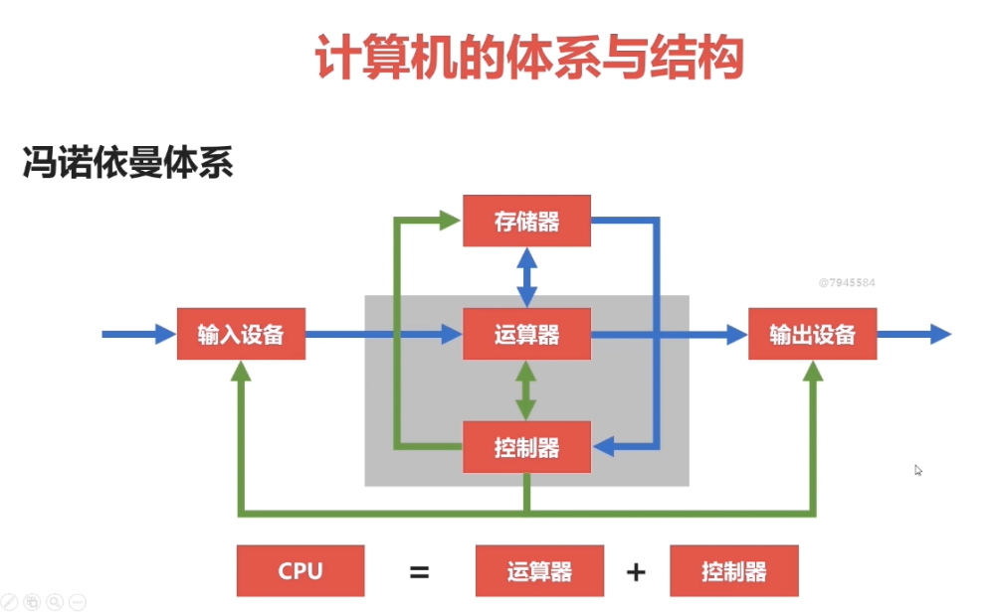
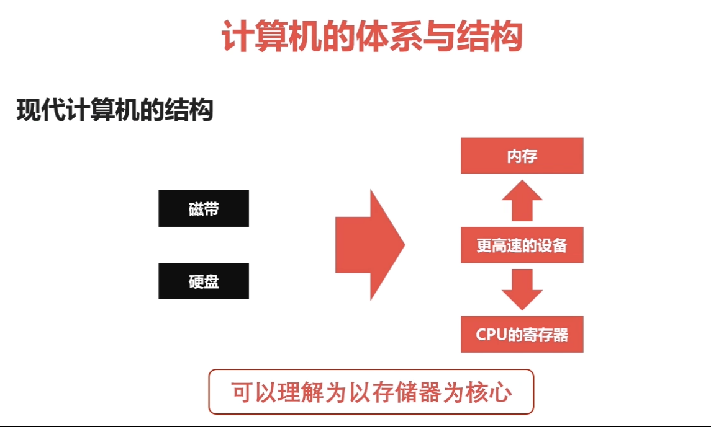

# Data Structure and Algorithm learning
Data Structure and Algorithm Learning —— 数据结构与算法学习笔记

- 待学习: 
    + https://github.com/MuYunyun/blog —— 数据结构

# 学习编程有没有必要做笔记? 如果做笔记?
1. 学编程有没有必要做笔记?
    + A: 十分肯定, 一定要做!
2. 我该记哪些内容?
    + A: 记笔记有 `3 记` 和 `3 不记`
        - **3 记**:
            + (1) 涉及到软件安装和配置 记
            + (2) 涉及到项目实战技能 记
            + (3) 涉及到出错问题必须记
        - **3 不记**:
            + (1) 书上有的知识点不记 (抛去上面 3 记)
            + (2) 网上已有完善的参考手册不记
            + (3) 看书的时候一定不记.

## 计算机的体系与结构

- 冯诺依曼体系和结构
    * 冯诺依曼体系:
        + (1) 能够把需要的程序和数据送至计算机中
        + (2) 能够长期记忆程序、数据、中间结果及最终运算结果的能力
        + (3) 能够具备算术、逻辑运算和数据传送等数据加工处理的能力
        + (4) 能够按照要求将处理结果输出给用户
    * 冯诺依曼结构图:
        + 
    * 冯诺依曼瓶颈:
        + CPU 和存储速率之间的问题无法调和.
- 现在计算机的体系与结构
    +  
    +  
        