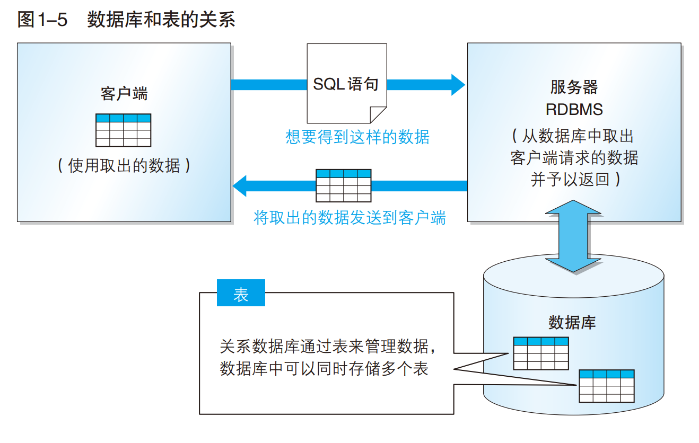

# SQL 基础教程 -- 第 2 版
- 本书的示例程序从下面网站下载:
    + http://www.ituring.com.cn/book/1880 (网也右侧的 "随书下载")

> 目录 (Table of Content)
- 第 0 章 -- 绪论--搭建 SQL 的学习环境
    + 0.1 PostgreSQL 的安装和连接设置
        - 0.1.1: 安装步骤
        - 0.1.2: 修改设置文件
    - 0.2 通过 PostgreSQL 执行 SQL 语句    
- 第 1 章 -- 数据库和 SQL
    + 1.1 数据库是什么
        + 1.1.1 我们身边的数据库
        + 1.1.2 为什么 DBMS 那么重要
        + 1.1.3 DBMS 的种类
    + 1.2 数据库的结构
        + 1.2.1 RDBMS 的常见系统结构
        + 1.2.2 表的结构
    + 1.3 SQL 概要
        + 1.3.1 标准 SQL
        + 1.3.2 SQL 语句及其种类
        + 1.3.3 SQL 的基本书写规范
    + 1.4 表的创建
        + 1.4.1 表的内容的创建
        + 1.4.2 数据库的创建 (CREATE DATABASE 语句) 
        + 1.4.3 表的创建 (CREATE TABLE 语句)
        + 1.4.4 命名规则
        + 1.4.5 数据类型的指定
        + 1.4.6 约束的设置
    + 1.5 表的删除和更新
        + 1.5.1 表的删除 (DROP TABLE 语句)
        + 1.5.2 表定义的更新 (ALTER TABLE 语句)
        + 1.5.3 向 Product 表中插入数据
    + 练习题  

---

## 生词

---

## 第 0 章 -- 绪论--搭建 SQL 的学习环境
- 0.1 PostgreSQL 的安装和连接设置
    + 0.1.1 安装步骤
    + 0.1.2 修改设置文件 
        + 安装和设置笔记见: `READMED.MD` 文件
- 0.2 通过 PostgreSQL 执行 SQL 语句 
    + > psql: 是 PostgreSQL 数据库的命令行交互工具
    + > pgAdmin: 是 PostgreSQL 数据库的图形化管理工具
    + PostgreSQL 提供了一个可以通过命令行来执行 SQL 语句的工具 "psql".psql 会把 
      SQL 语句发送给 PostgreSQL
    + 最基本的通过 psql 来执行 SQL 语句的命令:
        - 打开 postgresql 的安装目录进入到 `C:\PostgreSQL\10\bin` 然后在当前文件夹下
          按住 `shift` 单击鼠标右键打开 "在此处打开命令窗口(w)" 然后在当前运行窗口中输入
          `psql.exe -U postgres` 输入密码就会进入到 PostgreSQL 默认创建的 名为
          postgres 的示例数据库.
        - 输入如下命令: `SELECT 1;` 如果出现 
          ```
            ?column?
            --------
            (1 行记录)

            postgres=#
          ```
          就代表执行成功了.
        - 创建学习用的数据库: `CREATE DATABASE shop` (Tip:数据库的名称只能使用小写字母)
        - 结束 sql: 输入 `\q` (quit) 即可.
        - 连接上面创建的数据库(登录): 在当前 `C:\PostgreSQL\10\bin` 后面 输入 
          `psql.exe -U postgres -d shop`  (-d shop 是指定 "数据库 shop" 的意思. 
          -d 应该是 direct(指向) 的缩写.)

## 第 1 章 -- 数据库和 SQL
- 1.1 数据库是什么
    + A: 数据库是将大量数据保存起来, 通过计算机加工而成的可以进行高效访问的数据集合. 用来
      管理数据库的系统称为 "数据库管理系统 (`DBMS`: Database Management System)". 
      通过使用 DBMS, 多个用户便可安全, 简单地操作大量数据. 数据库有很多种类, 本书介绍如何
      使用专门的 SQL 语言来操作关系数据库.关系数据库通过 "关系数据库管理系统 (`RDBMS`: 
      Relational Database Management System)" 来进行管理.  
    + 1.1.1 我们身边的数据库
    + 1.1.2 为什么 DBMS 那么重要
    + 1.1.3 DBMS 的种类
        - DBMS 主要通过数据的保存格式 (数据库的种类) 来进行分类, 现阶段主要有一下 5 种.
        - (1) 层次数据库 (Hierarchical Database, HDB) 
        - (2) 关系型数据库 (Relational Database, RDB)
            + 关系数据库采用 <span style="color: green"> 由行和列组成的二维表管理数据
              </span>. 同时, 它还使用专门的 `SQL` (Structured Query Language 
              结构化查询语言) 对数据进行操作.
            + 这种类型的 DBMS 称为关系数据库管理系统 `RDBMS`. 比较具有代表性的 RDBMS 有
              如下 5 种:
                - Oracle Database
                - SQL Server
                - DB2
                - PostgreSQL
                - MySQL  
        - (3) 面向对象数据库 (Object Oriented Database, OODB)
        - (4) XML 数据库 (XML Database, XMLDB)
        - (5) 键值存储系统 (Key-Value Store, KVS)
- 1.2 数据库的结构
    + 1.2.1 RDBMS 的常见系统结构
        - 客户端/服务器类型 (C/S 类型)
    + 1.2.2 表的结构
        - 关系数据库由行和列组成的二维表来管理数据. 用来管理数据的 `二维表` 在关系数据库
          中简称为 `表`. 
        -   
        - 根据 SQL 语句的内容返回的数据同样必须是二维表的形式. 这也是关系数据库的特征之一.
        - 表的 `列 (column 垂直方向)` 称为 `字段 (filed)`
        - 表的 `行 (row 水平方向)` 称为 `记录 (record)`. 
        - `关系数据库必须一行为单位进行数据读写.`  
- 1.3 SQL 概要
    + 1.3.1 标准 SQL
        - SQL 是用来操作关系数据库的语言. 它原来是为了**提高数据库查询效率**而开发的语言, 
          但是现在不仅可以进行数据查询, 就连数据的**插入**和**删除**等操作也基本上都可以
          通过 SQL 来完成了.
        - 国际标准化组织 (ISO) 为 SQL 制定了相应的标准, 以此为基准的 SQL 称为 `标准SQL`  
    + 1.3.2 SQL 语句及其种类
        - SQL 用 `关键字`, `表名`, `列名` 等组合而成的一条语句 (SQL 语句) 来比描述操作
          的内容. 关键字是指那些含义或使用方法已实现定义好的英语单词, 存在包含 "对标进行
          查询" 或者 "参考这个表" 等各种意义的关键字. 根据对 RDBMS 赋予的指令种类的不同,
          SQL 语句可以分为以下 3 类.
            + (1) `DDL` (Data Definition Language, 数据定义) 用来 "创建" 或 "删除"
              存储数据用的数据库以及数据库中的表等对象. DDL 包含以下几种指令:
                - <span style="color: green">CREATE</span> : 创建数据库和表等对象 
                - <span style="color: green">DROP</span> : 删除数据库和表等对象
                - <span style="color: green">ALTER</span> : 修改数据库和表等对象的结构
            + (2) `DML` (Data Manipulation Language, 数据操纵语言) 用来 "查询" 或
              "变更" 表中的记录. DML 包含以下几种指令.
                - <span style="color: green">SELECT</span> : 查询表中的数据
                - <span style="color: green">INSERT</span> : 向表中插入新数据
                - <span style="color: green">UPDATE</span> : 更新表中的数据
                - <span style="color: green">DELETE</span> : 删除表中的数据
            + (3) `DCL` (Data Control Language, 数据控制语言) 用来确认或者取消对数据
              库中的数据进行的变更. 除此之外, 还可以对 RDBMS 的用户
    + 1.3.3 SQL 的基本书写规范
        - 本书 SQL 书写规范
            - (1) 关键字大写 (Tip: sql 语法上来讲, 关键字不区分大小写)
            - (2) 表名的首字母大写
            - (3) 其余 (列名等) 小写
- 1.4 表的创建
    + 1.4.1 表的内容的创建
    + 1.4.2 数据库的创建 (CREATE DATABASE 语句) 
      
        - `CREATE DATABASE shop;`
    + 1.4.3 表的创建 (CREATE TABLE 语句)
        - ```sql
            # 代码清单 1-2 创建 Product 表的 CREATE TABLE 语句
            CREATE TABLE Product
            (product_id      CHAR(4)      NOT NULL,
            product_name    VARCHAR(100) NOT NULL,
            product_type    VARCHAR(32)  NOT NULL,
            sale_price      INTEGER ,
            purchase_price  INTEGER ,
            regist_date     DATE ,
            PRIMARY KEY (product_id));
          ```
    + 1.4.4 命名规则
    + 1.4.5 数据类型的指定
    + 1.4.6 约束的设置
- 1.5 表的删除和更新
    + 1.5.1 表的删除 (DROP TABLE 语句)
        - 删除 Product 表: `DROP TABLE Product;`
    + 1.5.2 表定义的更新 (ALTER TABLE 语句)
        - 变更表定义的 `ALTER TABLE 语句` 
        - (1) 首先是添加列时使用的语法: 
            + 语法 1-4 添加列的 ALTER TABLE 语句   
                - `ALTER TABLE <表名> ADD COLUMN <列的定义>;`
            + 代码清单 1-4 添加一列可以存储 100 位的可变长字符串的 product_name_pinyin 列
                - **DB2, PostgreSQL, MySQL**
                    + > `ALTER TABLE Product ADD COLUMN product_name_pinyin VARCHAR(100);`
                - **Oracle**  
                    + > `ALTER TABLE Product ADD (product_name_pinyin VARCHAR(100));`
                - **SQL Server**
                    + > `ALTER TABLE Product ADD product_name_pinyin VARCHAR(100);`  
        - (2) 反之, 删除表中某列使用的语法如下所示:
            + 语法 1-5 删除列的 ALTER TABLE 语句
                - `ALTER TABLE <表名> DROP COLUMN <列名>;`  
                - 特定的 SQL : `Oracle` 中不用写 COLUMN...... 详细见 P39 
            + 代码清单 1-5 删除 product_name_pinyin 列
                -  **SQL Server, DB2, PostgreSQL, MySQL**  
                    + `ALTER TABLE Product DROP COLUMN product_name_pinyin;`
                -  **Oracle**
                    + `ALTER TABLE Product DROP (product_name_pinyin);`             
+ 1.5.3 向 Product 表中插入数据
    - 代码清单 1-6 向 Product 表中插入数据的 SQL 语句
        + **SQL Server, PostgreSQL**
            - ```sql
                BEGIN TRANSACTION;
                INSERT INTO Product VALUES ('0001', 'T恤', '衣服', 1000, 500, '2009-09-20');
                INSERT INTO Product VALUES ('0002', '打孔器', '办公用品', 500, 320, '2009-09-11');
                INSERT INTO Product VALUES ('0003', '运动T恤', '衣服', 4000, 2800, NULL);
                INSERT INTO Product VALUES ('0004', '菜刀', '厨房用具', 3000, 2800, '2009-09-20');
                INSERT INTO Product VALUES ('0005', '高压锅', '厨房用具', 6800, 5000, '2009-01-15');
                INSERT INTO Product VALUES ('0006', '叉子', '厨房用具', 500, NULL, '2009-09-20');
                INSERT INTO Product VALUES ('0007', '擦菜板', '厨房用具', 860, 790, '2008-04-28');
                INSERT INTO Product VALUES ('0008', '圆珠笔', '办公用品', 100, NULL, '2009-11-11'); 
                COMMIT;
              ```
    + 专栏: 变更表名
        - 代码清单 1-A 变更表名
            +           
- 练习题    