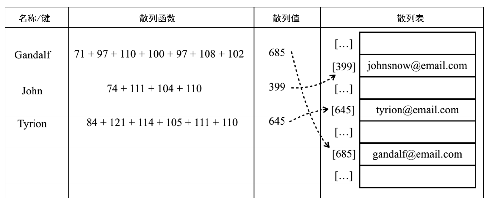
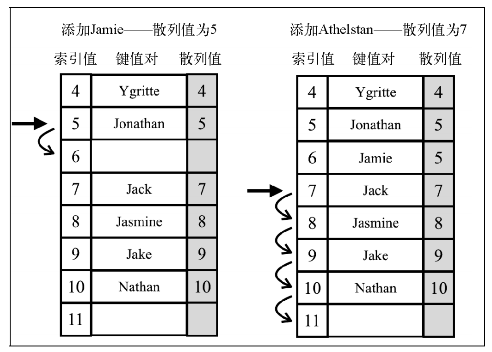

# 第 8 章 -- 字典 (Dictionary/Map) 和 散列表 (Hash table)

## 本章目录 (Catalog)
- 8.1 字典 (Dictionary/Map)
    + 8.1.1 创建字典类
    + 8.1.2 使用 Dictionary/Map 类
- 8.2 散列表 (Hash table, 也叫哈希表)
    + 8.2.1 创建散列表
    + 8.2.2 使用 HashTable 类 
    + 8.2.3 散列表和散列集合
    + 8.2.4 处理散列表中的冲突
    + 8.2.5 创建更好的散列函数
- 8.3 ES2015 Map 类
- 8.4 ES2015 WeakMap 类 和 WeakSet 类
- 8.5 小结


## 生词 (New Words)
- **probe [prəʊb] --v.探测，探讨**
    + probe type 探测类型
    + hash table linear probing lazy 散列表线性惰性探查 / 哈希表线性探测惰性


## 本章内容 (Contents)
- 上一张我们学习了集合. 本章将继续学习使用 字典 和 散列表 来存储唯一值(不重复的值)的
  数据结构.
- 在集合(Set)中, 我们感兴趣的是每个值本身, 并把它当做主要元素. 在 
  `字典(Dictionary)/映射(Map)`中, 我们用 **`[键, 值]`** 对的形式来存储数据. 
  在散列表(HashTable)中也是一样, 也是 `[键, 值]` 对的形式来存储数据.
  但是两种数据结构的实现略有不同, 例如**字典中的每个键只能有一个值**, 本章中会介绍.
### 8.1 字典 (Dictionary)
- 集合表示一组互不相同的元素(不重复的元素). 在字典中, 存储的是 `[键, 值]` 对, 其中键名
  是用来查询特定元素的. 字典和集合很相似, 集合以 `[值, 值]` 的形式存储元素. 字典也称作
  **映射 / 符号表 / 关联数组**.
#### 8.1.1 创建字典类
- **与 Set 类相似, ECMAScript 2015 同样包含了一个 Map 类的实现, 即我们所说的字典.**
- 本章将要实现的类就是以 ECMAScript 2015 中 Map 类的实现为基础的. 你会发现它和
    Set 类很形似, 但不同于存储 [值, 值] 对的形式, 我们将要存储的是 `[键, 值]` 对.
- 然后我们需要声明一些 `映射(Map)/字典(Dictionary)` 所能使用的方法.
    + `set(key, value)`: 向字典中添加新元素. 如果 key 已经存在, 那么存在的
        value 会被新的值覆盖.
    + `remove(key)`: 通过使用键值作为参数来从字典中移除键值对应的数据值.
    + `hasKey(key)`: 如果某个键值存在于该字典中, 返回 true, 否则返回 false.
    + `get(key)`: 通过以键值作为参数查找特定的数值并返回.
    + `clear()`: 删除该字典中的所有值.
    + `size()`: 返回字典所包含值的数量. 与数组的 length 属性类似.
    + `isEmpty()`: 在 size 等于 0 的时候返回 true, 否则返回 false.
    + `keys()`: 将字典所包含的所有键名以数组形式返回.
    + `values()`: 将字典所包含的所有值 以数组形式返回.
    + `keyValues()`: 将字典中的所有, 以 [键, 值] 对返回.
    + `forEach(callbackFn)`: 迭代字典中所有的键值对. callbackFn 有 2 个参数:
        key 和 value. 该方法可以在回调函数返回 false 时被中止 (和 Array 类中的
        every 方法相似.)
#### 8.1.2 使用 Dictionary 类
- 完整代码见同级目录: `01-字典-Dictionary.html`

### 8.2 散列表 (Hash table, 也叫哈希表)
* 本节你将学到 `HashTable` 类, 也叫 `HashMap` 类, **它是 Dictionary 类的一种**
  **散列表实现方式. `散列`算法的作用是尽可能快地在数据结构中找到一个值**. 散列函数
  (loseloseHashCode) 的作用是给定一个键值, 然后返回值在表中的地址.
* 散列表有一些在计算机科学中应用的例子。因为它是字典的一种实现，所以可以用作关联数组。
  它也可以用来对数据库进行索引。当我们在关系型数据库（如 MySQL、 Microsoft SQL Server、
  Oracle，等等）中创建一个新的表时，一个不错的做法是同时创建一个索引来更快地查询到记录
  的 key。在这种情况下，散列表可以用来保存键和对表中记录的引用。另一个很常见的应用是使
  用散列表来表示对象。 JavaScript 语言内部就是使用散列表来表示每个对象。此时，对象的每个
  属性和方法（成员）被存储为 key 对象类型，每个 key 指向对应的对象成员。
* 继续以前一节中使用的电子邮件地址薄为例. 我们将使用最常见的散列函数 -- `lose lose 散列`
  函数, 方法是简单地将每个键值中的每个字母的 ASCII 相加, 如下图所示:  
    
### 8.2.1 创建散列表
- 我们继续使用一个关联数组(对象 -- this.table = {}) 来表示我们的数据结构, 和
      我们在 Dictionary 类中所做的一样.
- 然后, 给类添加一些方法, 我们给每个类实现 3 个基本方法:
    + `put(key, value)`: 向散列表增加一个新的项 (也能更新散列表)
    + `remove(key)`: 根据键值从散列表中移除值.
    + `get(key)`: 返回根据键值检索到的特定的值.
- (1) 创建散列函数 : `loseloseHashCode(key)` 
    + 在实现上面 3 个方法之前, 我们要实现的第一个方法是散列函数, 它的代码如下:
        ```js
        // - 讲解和代码见 `02-散列表-HashTable.html`
        loseloseHashCode(key) {}
        hashCode(key) {}
        ```
- (2) 将键和值加入到散列表: `put(key, value)`
  
    + 代码和讲解见 *02-散列表-HashTable.html* 
- (3) 从散列表中获取一个值: `get(key)`
- (4) 从散列表中移除一个值: `remove(key)`
#### 8.2.2 使用 HashTable 类
- 完整代码见同级目录: `02-散列表-HashTable.html`
#### 8.2.3 散列表和散列集合
- `散列表(HashTable)`和`散列映射(HashMap)`是一样的, 我们已经在本章中介绍了这种
    数据结构.
- 在一些编程语言中, 还有一种叫作 `散列集合 (Hash Collection)` 的实现. 散列集合
    由一个集合构成, 但是插入,移除或获取元素时, 使用的是 `hashCode` 函数. (hashCode
    方法调用 loseloseHashCode 方法，将 key 作为参数传入。)
    **我们可以复用本章中所有的代码来实现散列集合, 不同之处在于, 不再添加键值对,** 
    **而是只插入值没有键.** 例如, 可以使用散列集合来存储所有的英语单词(不包括它们的
    定义). 和集合(Set) 相似, 散列集合只存储不重复的唯一值.
#### 8.2.4 处理散列表中的冲突
- 有时候, 一些键会有相同的散列值. 不同的值在散列表中对应相同位置的时候, 我们称为
  称其为 `冲突`. 例如, 我们看看下面的代码会得到怎样的输出结果.
  ```js
    const hash = new HashTable();
    hash.put('Ygritte', 'ygritte@email.com');
    hash.put('Jonathan', 'jonathan@email.com');
    hash.put('Jamie', 'jamie@email.com');
    hash.put('Jack', 'jack@email.com');
    hash.put('Jasmine', 'jasmine@email.com');
    hash.put('Jake', 'jake@email.com');
    hash.put('Nathan', 'nathan@email.com');
    hash.put('Athelstan', 'athelstan@email.com');
    hash.put('Sue', 'sue@email.com');
    hash.put('Aethelwulf', 'aethelwulf@email.com');
    hash.put('Sargeras', 'sargeras@email.com');
  ```
- 通过对每个提到的名字调用 hash.hashCode 方法，输出结果如下。
    + 4 - Ygritte
    + 5 - Jonathan
    + 5 - Jamie
    + 7 - Jack
    + 8 - Jasmine
    + 9 - Jake
    + 10 - Nathan
    + 7 - Athelstan
    + 5 - Sue
    + 5 - Aethelwulf
    + 10 - Sargeras  
- 注意, Nathan 和 Sargeras 有相同的散列值 (10). Jack 和 Athelstan 有相同的
  散列值（7），Jonathan、Jamie、Sue 和 Aethelwulf 也有相同的散列值（5）。
- 我们调用 toString 方法来看一下输出结果, 下面为输出: 
- {4 => [#Ygritte: ygritte@email.com]} <br/>
  {5 => [#Aethelwulf: aethelwulf@email.com]} <br/>
  {7 => [#Athelstan: athelstan@email.com]} <br/>
  {8 => [#Jasmine: jasmine@email.com]} <br/>
  {9 => [#Jake: jake@email.com]} <br/>
  {10 => [#Sargeras: sargeras@email.com]}
- Jonathan、 Jamie、 Sue 和 Aethelwulf 有相同的散列值，也就是 5。由于
  Aethelwulf 是最后一个被添加的，它将是在 HashTable 实例中占据位置 5 的元素。
  首先 Jonathan 会占据这个位置，然后 Jamie 会覆盖它， Sue 会再次覆盖，最后
  Aethelwulf 会再覆盖一次。这对于其他发生冲突的元素来说也是一样的。
- 使用一个数据结构来保存数据的目的显示不是丢失这些数据, 而是通过某种方法将它们全部保存
    起来. 因此, 当这种情况发生的时候就要去解决. 处理冲突有几种方法: `分离链表`, 
    `线性探查` 和 `双散列`法. 在本书中, 我们会介绍前 2 种方法.
- **`1.分离链表`**
    + `分离链表`法包括为散列表的每一个位置创建一个 
        **`链表 (LinkedList-- chapter06)`**并将元素存储在里面. 它是解决冲突的
        最简单的方法, 但是在 HashTable 实例之外还需要额外的存储空间.
    + 例如，我们在之前的测试代码中使用分离链接并用图表示的话，输出结果将会是如下这样
        (为了简化，图表中的值被省略了).  
        
    + 在位置 5 上有包含 4 个元素的 LinkedList 实例; 位置 7 和 10 上，包含 
        2 个元素的 LinkedList 实例；在位置 4、 8 和 9 上只包含单个元素的
        LinkedList 实例。
    + 对于分离链接和线性探查来说，只需要重写三个方法： `put`、 `get` 和 
        `remove`。这三个方法在每种技术实现中都是不同的。和之前一样，我们来声明
        HashTableSeparateChaining 的基本结构。
        ```js
        class HashTableSeparateChaining {
            constructor(toStrFn = defaultToString) {
                this.toStrFn = toStrFn;
                this.table = {};
            }
        }  
        ```
    + 完整代码键: `03-hash-table-separate-chaining.html`    
- **`2.线性探查`**
    + 另一种解决冲突的方法是`线性探查`. 之所以称作线性, 是因为它处理冲突的方法是将元素
      直接存储到表中, 而不是在单独的数据结构中.
    + 当想向表中某个位置添加一个新元素的时候，如果索引为 position 的位置已经被占据了，
      就尝试 position+1 的位置。如果 position+1 的位置也被占据了，就尝试 
      position+2 的位置，以此类推，直到在散列表中找到一个空闲的位置。想象一下，有一个
      已经包含一些元素的散列表，我们想要添加一个新的键和值。我们计算这个新键的 hash，
      并检查散列表中对应的位置是否被占据。如果没有，我们就将该值添加到正确的位置。如果
      被占据了，我们就迭代散列表，直到找到一个空闲的位置。
    + 下图展示了这个过程: (Tip: 图中的键值对省略了 值(value))
        
    + 当我们从散列表中移除一个键值对的时候，仅将本章之前的数据结构所实现位置的元素移除
      是不够的。如果我们只是移除了元素，就可能在查找有相同 hash（位置）的其他元素时
      找到一个空的位置，这会导致算法出现问题。
    + 线性探查技术分为两种。
        - `第一种是软删除方法。`我们使用一个特殊的值（标记）来表示键值对被删除了
         （惰性删除或软删除），而不是真的删除它。经过一段时间，散列表被操作过后，我们会
          得到一个标记了若干删除位置的散列表。这会逐渐降低散列表的效率，因为搜索键值会
          随时间变得更慢。能快速访问并找到一个键是我们使用散列表的一个重要原因。
          下图展示了这个过程。
           
        - `第二种方法需要检查是否有必要将一个或多个元素移动到之前的位置.` 当搜索
          一个键的时候，这种方法可以避免找到一个空位置。如果移动元素是必要的，我们就
          需要在散列表中挪动键值对。下图展现了这个过程。
           
        - 两种方法都有各自的优缺点。本章会实现第二种方法 (移动一个或多个元素到之前的位置)
          即 `hash-table-linear-probing`类 
请参考本书源代码。    
#### 8.2.5 创建更好的散列函数
### 8.3 ES2015 Map 类
### 8.4 ES2015 WeakMap 类 和 WeakSet 类
### 8.5 小结