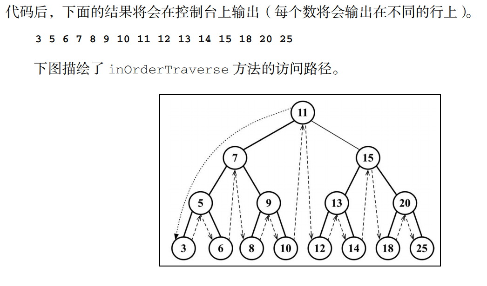
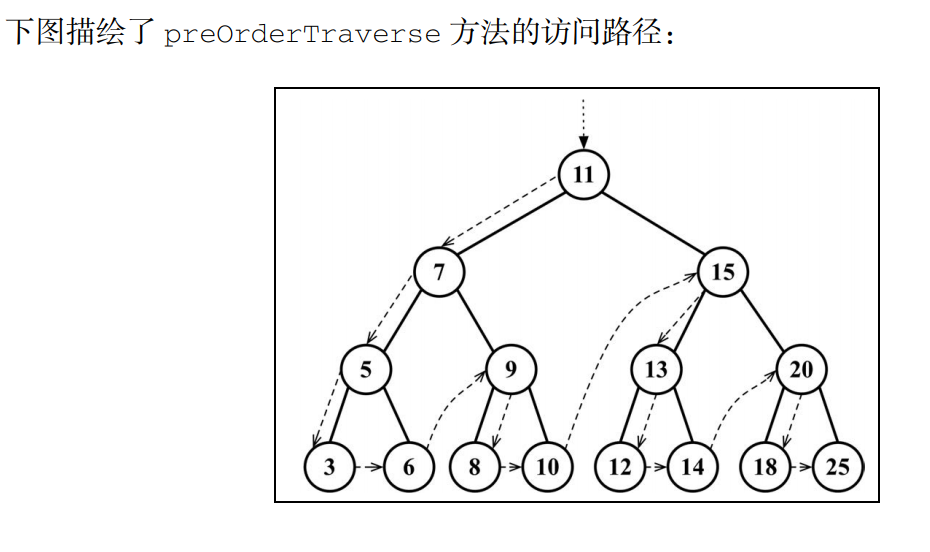
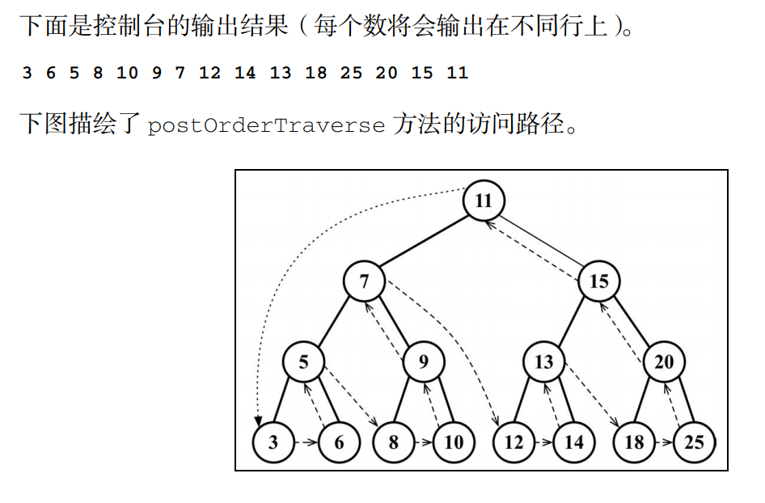

# 第 10 章 -- 树

## 本章目录 (Catalog)
- 10.1 树数据结构
- 10.2 树的相关术语 
- 10.3 二叉树和二叉搜索树
    + 10.3.1 创建 `BinarySearchTree` 类
    + 10.3.2 向二叉搜索树中插入一个键
- 10.4 树的遍历
    + 10.4.1 中序遍历
    + 10.4.2 先序遍历
    + 10.4.3 后序遍历
- 10.5 搜索树中的值
    + 10.5.1 搜索最小值和最大值
    + 10.5.2 搜索一个特定的值
    + 10.5.3 移除一个节点
- 10.6 自平衡书
    + 10.6.1 `Adelson-Velskii-Landi` 树 (AVL 树)
    + 10.6.2 红黑树
- 10.7 小结


## 生词 (New Words)
- **binary ['baɪnərɪ] --adj.二元的，二进制的**
- **traverse ['trævəs] --vt.横过, 穿越. --n.横贯; 横木**
    + The railroad traverses(vt) the Continent from East to West.
      铁路东西横贯北美大陆.
- **breadth [bredθ] --n.宽度, 广度; (性格,胸襟等的)宽宏大度; (知识的)广博**
    + the breadth of this river? 这条河的宽度是多少?
    + breadth of mind. 胸襟远大
    + Breadth-First-Search. 广度优先查找
    + Depth-First-Search. 深度优先查找
- **post [pəʊst] --n.邮(件/政); 职位, 岗位, 职务. --v.邮寄, 邮递**
    + post-order traverse 后序遍历 (不知道 "后序遍历" 这里的 post 是怎么翻译的)
    + send a letter by post(n). 邮寄信件
    + The post hasn't come yet. 邮件还没来.
    + I had a heavy post yesterday. 我昨天收了很多邮件

## 本章内容 (Content)
- 到目前为止, 本书已经介绍了一些顺序数据结构, 而第一个非顺序数据结构是 **散列表**. 
  在本章我们将要学习另外一种非顺序数据结构 -- **树**, 它对于存储需要快速查找的数据非常有用.
### 10.1 树数据结构
- 树是一种分层数据的抽象模型. 现实生活中最常见的树的例子是家谱, 或是公司的组织架构图.
### 10.2 树的相关术语 
- 一个树结构包含一系列存在父子关系的节点。每个节点都有一个父节点（除了顶部的第一个
  节点）以及零个或多个子节点:  
   
    + 位于树顶部的节点叫作`根节点`（11）。它没有父节点。树中的每个元素都叫作节点，节点分为
      `内部节点`和 `外部节点(或: 叶节点)`。至少有一个子节点的节点称为内部节点（ 7、 5、
       9、 15、 13 和 20 是内部节点）。没有子元素的节点称为外部节点或叶节点
       ( 3、 6、 8、 10、 12、 14、 18 和 25 是叶节点)。
    + 一个节点可以有祖先和后代。一个节点（除了根节点）的祖先包括父节点、祖父节点、
      曾祖父节点等。一个节点的后代包括子节点、孙子节点、曾孙节点等。例如，节点 5 的祖先有
      节点 7 和节点 11，后代有节点 3 和节点 6。
    + 有关树的另一个术语是`子树`。子树由节点和它的后代构成。例如，节点 13、 12 和 14 构成
      了上图中树的一棵子树。
    + 节点的一个属性是**深度**，节点的深度取决于它的祖先节点的数量。比如，节点 3 有 3 个
      祖先节点（ 5、7 和 11），它的深度为 3。
    + 树的高度取决于所有节点深度的最大值。一棵树也可以被分解成层级。根节点在第 0 层，它的
      子节点在第 1 层，以此类推。上图中的树的高度为 3（最大高度已在图中表示——第 3 层）。
### 10.3 二叉树和二叉搜索树
- **二叉树**中最多只能有 2 个子节点: 一个是左侧子节点, 另一个是右侧子节点. 这个定义
  有助于我们写出高效地在树中插入, 查找和删除节点的算法. 二叉树在计算机科学中的应用非常广泛.
- **二叉搜索树 (BST)** 是二叉树的一种, 但是只允许你在左侧节点存储 (比父节点) 小的值, 
  在右侧节点存储 (比父节点) 大的值. 上一节的图中就展现了一颗二叉搜索树.  
- 10.3.1 创建 `BinarySearchTree` 类
- 10.3.2 向二叉搜索树中插入一个键

### 10.4 树的遍历
#### (1) 广度优先 (BFS: Breadth-First-Search):
+ 属于 `Level-Order 层次遍历`: 先访问离根节点最近的节点.
+ 又译作 宽度优先搜索, 或横向优先搜索, 是一种图形搜索算法. 简单的说, BFS 是
    从根节点开始, 沿着树的宽度遍历树的节点. 如果所有节点均被访问, 则算法中止. 
    广度优先搜索的实现一般采用 open-closed 表.
    
+ |类别| 搜索算法|
    |:---:|:---:|
    |数据结构 | 图|
    |时间复杂读 | $O(|V| + |E|) = O(b^d)$|
    |空间复杂读 | $O(|V| + |E|) = O(b^d)$|
    |最佳解: | 是 |
    |完全性: | 是 |
+ 作法: 
    - BFS是一种盲目搜索法，目的是系统地展开并检查图中的所有节点，以找寻结果。
        换句话说，它并不考虑结果的可能地址，彻底地搜索整张图，直到找到结果为止。
        BFS并不使用经验法则算法。
    - 从算法的观点，所有因为展开节点而得到的子节点都会被加进一个先进先出的
        队列中。一般的实现里，其邻居节点尚未被检验过的节点会被放置在一个被
        称为 open 的容器中（例如队列或是链表），而被检验过的节点则被放置在
        被称为 closed 的容器中。(open-closed表)
+ 实现方法
+ 特性: 见 [Wiki](https://zh.wikipedia.org/zh-cn/%E5%B9%BF%E5%BA%A6%E4%BC%98%E5%85%88%E6%90%9C%E7%B4%A2)      
#### (2) 深度优先 (DFS: Depth-First-Search)
- 深度优先搜索算法 是一种用于遍历或搜索树或图的算法. 沿着树的深度遍历树的节点, 尽可能深的
  搜索树的分支. 当节点 v 的所在边都已被探寻过, 搜索将回溯到发现节点 v 的那条边的起始节点.
  这一过程一直进行到已发现从源节点可达的所有节点为止. 如果还存在未被发现的节点, 则选择其中
  一个作为源节点并重复以上过程, 整个进程反复进行直到所有节点都被访问为止. 属于盲目搜索.
    + 深度优先搜索是图论中的经典算法, 利用深度优先搜索算法可以产生目标图的相应拓扑排序表, 
      利用拓扑排序表可以方便的解决很多相关的图论问题, 如最大路径问题等等.
    + 因发明“深度优先搜索算法”，约翰·霍普克洛夫特与罗伯特·塔扬在1986年共同获得计算机领域
      的最高奖：图灵奖。[1]
    + 下面的更多讲解见: "深度优先搜索算法 -- Wiki"
- 10.4.1 `In-order 中序遍历`: `按从小到大的顺序遍历`
    + 中序遍历是一种以上行(xing)顺序访问 BST 所有节点的遍历方式,
      **也就是以从最小到最大的顺序访问所有节点**. 中序遍历的一种应用就是对树进行排序操作. 
      我们来看看它的实现.
      ```javascript
        inOrderTraverse(callback) {
            this.inOrderTraverseNode(this.root, callback);  // {1}
        }
      ```
      inOrderTraverse 方法接收一个回调函数作为参数。回调函数用来定义我们对遍历到的
      每个节点进行的操作（这也叫作访问者模式，要了解更多关于访问者模式的信息，请参考
      http://en.wikipedia.org/wiki/Visitor_pattern）。由于我们在 BST 中最常实现的
      算法是递归，这里使用了一个辅助方法，来接收一个节点和对应的回调函数作为参数（行{1}）。
      辅助方法如下所示。
      ```javascript
        inOrderTraverseNode(node, callback) {
            if (node != null) { // {2}
                this.inOrderTraverseNode(node.left, callback);  // {3}
                callback(node.key); // {4}
                this.inOrderTraverseNode(node.right, callback); // {5}
            }
        }
      ```
      要通过中序遍历的方法遍历一棵树，首先要检查以参数形式传入的节点是否为 null
      (行{2}——这就是停止递归继续执行的判断条件，即递归算法的基线条件)。  
      然后，递归调用相同的函数来访问左侧子节点（行{3}）。接着对根节点（行{4}）进行一些
      操作（ callback），然后再访问右侧子节点（行{5}）。  
      我们试着在之前展示的树上执行下面的方法.  
      ```javascript
        const printNode = (value) => console.log(value);    // {6}
        tree.inOrderTraverse(printNode);    // {7}
      ```
      首先, 需要创建一个回调函数 (行 {6}). 我们要做的, 是在浏览器的控制台上输出节点的值.
      然后, 调用 inOrderTraverse 方法并将回调函数作为参数传入 (行 {7}). 当执行上面的  
      
- 10.4.2 `Pre-order 前(先)序遍历`: `先访问根再访问子, 一级一级往下遍历.`
    + 先序遍历是以**优先于后代节点的顺序访问每个节点**. 先序遍历的一种应用是打印
      一个结构化的文档.    
      
- 10.4.3 `Post-order 后序遍历`: `先访问节点的后代节点, 再访问节点本身.`
    + 后序遍历则是优先访问节点的后代节点, 再访问节点本身.  
      

### 10.5 搜索树中的值
- 10.5.1 搜索最小值和最大值
- 10.5.2 搜索一个特定的值
- 10.5.3 移除一个节点

### 10.6 自平衡树 (平衡二叉树)
- 10.6.1 `Adelson-Velskii-Landi` 树 (AVL 树)
    + Wiki: 在计算机科学中, `AVL树` 是最早被发明的自平衡二叉查找树. 在 AVL 树中, 
      `任一节点对应的 2 棵子树的最大高度差为 1`, 因此它也被称为 高度平衡树. 查找, 插入
      和删除在平均和最坏情况下的时间复杂度都是 $O(\log{n})$. 增加和删除元素的操作则可能
      需要借由一次或多次树旋转, 以实现树的重新平衡. AVL 树得名与它的发明者 
      G.M.Adelson-Velsky 和 Evgenii Landis, 他们在 1962 年的论文 
     《An algorithm for the organization of information》中公开了这一数据结构.
- 10.6.2 `红黑树 (Red-Black-Tree)`
    + 什么是红黑树? 
        - A: 和 AVL 树一样, 红黑树也是一种**自平衡二叉搜索树**.
            + (1) 对 AVL 树插入和移除节点可能会造成旋转, 所以我们需要一个包含多次插入和
              删除的自平衡树, 红黑树是比较好的选择.
            + (2) 如果插入和删除频率较低 (即: 更需要多次进行搜索操作), 那么 AVL 树比
              红黑树更好.
            + Tip: 从上面 2 点可以看出 **AVL树更适合搜索操作, 红黑树更适合插入和删除操作**
    + 红黑树有什么特性?
        - (1) 节点是红色或黑色.
        - (2) 根节点是黑色.    
        - (3) 每个叶子节点都是黑色的空节点 (NIL 节点).
        - (4) 每个红色节点的 2 个子节点都是黑色. (从每个叶子到根的所有路径上不能有 2 个
          连续的红色节点)
        - (5) 从任一节点到其每个叶子的所有路径都包含相同数目的黑色节点. (从给定的节点到
          它的后代节点 (Null 叶节点)的所有路径包含相同数量的黑色节点)
    + Tip: [关于红黑树的详细讲解见此文章](https://juejin.im/post/5a27c6946fb9a04509096248)


### 10.7 小结


## 来源 -- 详解什么是平衡二叉树(AVL) 
- [原文](https://www.cxyxiaowu.com/1663.html)
### 6. AVL 树的 4 种插入节点方式:
- 假设一颗 AVL 树的某个节点为 A (暂定为 "根节点"), 有 4 种操作会使 A 的左右子树高度差
  大于 1, 从而破坏了原有 AVL 树的平衡性. 平衡二叉树插入节点的情况分为以下 4 种:
    + | 插入方式 | 描述 | 旋转方式 |
      |:---:|:---:|:---:|
      | LL | 在 A 的 **左子树节点** 的左子树上插入节点而破坏平衡 | 右旋转|
      | RR | 在 A 的 **右子树节点** 的右子树上插入节点而破坏平衡 |左旋转|
      | LR | 在 A 的 **左子树节点** 的右子树上插入节点而破坏平衡 |先左旋后右旋|
      | RL | 在 A 的 **右子树节点** 的左子树上插入节点而破坏平衡 |先右旋后左旋|
