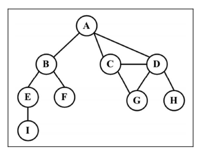
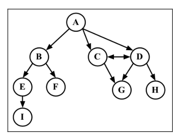
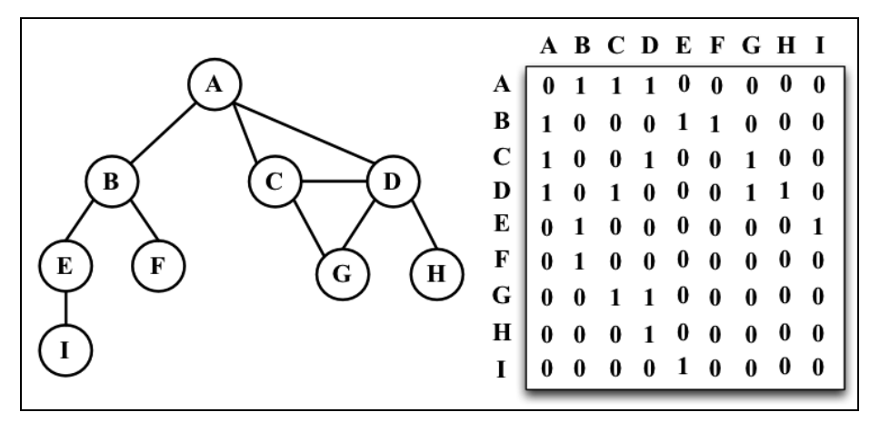
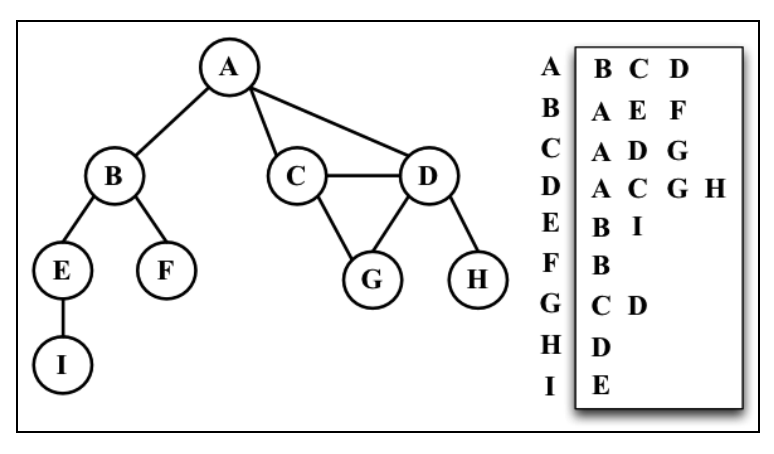
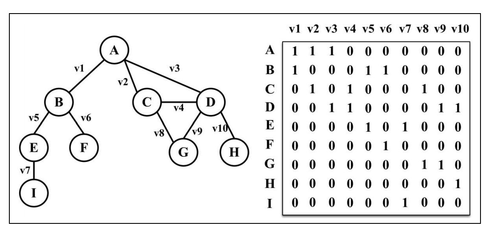
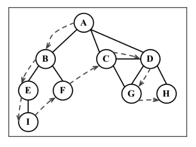
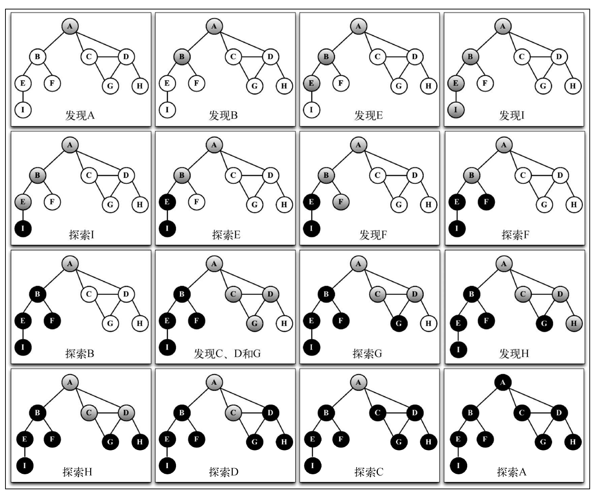

# 第 12 章 -- 图 (Graph)

## 本章目录 (Catalog)
- 12.1 图的相关术语
    + 有向图和无向图
- 12.2 图的表示
    + 12.2.1 邻接矩阵
    + 12.2.2 邻接表
    + 12.2.3 关联矩阵
- 12.3 创建 Graph 类
- 12.4 图的遍历
    + 12.4.1 广度优先搜索
    + 12.4.2 深度优先搜索
- 12.5 最短路径算法
    + 12.5.1 Dijkstra 算法
    + 12.5.2 Floyed-Warshall 算法
- 12.6 最小生成树
    + 12.6.1 Prim 算法
    + 12.6.2 Kruskal 算法
- 12.7 小结        


## 生词 (New Words)
- **vertex ['vɜːteks] --n.顶点; 头顶**
    + the vertex of a mountain. 山峰.
    + vertex angle 顶角
- **direct [dɪ'rekt] --adj.直接的, 正面的. --vt&vi.指导, 指挥, 导向**
    + directed graph 有向图
    + a direct way to the station. 直往火车站的路 [最近的路]
    + I have directed him wrongly. 我给他指错了路.    
- weighted graph. 加权图
- **vertices ['vɜːtɪsiːz] --n.顶点, 头顶, 极点 (vertex 的复数)**
    + merge vertices. 合并顶点
- **adjacent [ə'dʒeɪs(ə)nt] --adj.相邻的, 邻边的** 
    + adjacent list 相邻列表
- **adjacency [ə'dʒeɪsənsɪ] --n.邻接, 邻近**
- **matrix ['meɪtrɪks] --n.矩阵，模型**
    + augmented matrix 增广矩阵
    + correlation matrix 相关矩阵
    + determinant of a matrix 矩阵的行列式
- **incidence ['ɪnsɪd(ə)ns] --n.发生率, 影响范围**
    + decrease the incidence of a disease. 减少某疾病的发病率.
- **directed [dɪ'rektɪd] --adj.定向的; 经指导的; 被控制的.**
    **--v.指导, 管理(direct的过去式和过去分词)**
    + directed graph 有向图; 定向图
    + directed line: 有向直线; 有向元
    + directed distance: 有向距离
    + a directed(adj) study progarm 有指导的学习计划
    + the self-directed study of a language. 自我指导地对一门语言的学习.
- **breadth [bredθ] --n.宽度, 广度; (性格,胸襟等的)宽宏大度; (知识的)广博**
    + the breadth of this river? 这条河的宽度是多少?
    + breadth of mind. 胸襟远大
    + Breadth-First-Search. 广度优先查找
    + Depth-First-Search. 深度优先查找   
- **Μ(μ): Mu [mjuː] --n.希腊字母的第12个字母**     
- **N(ν): Nu [nu:] --n.希腊字母的第13个字母**
- **predecessor ['priːdɪsesə] --n.前任, 前辈**
    + Predecessor Task: 前导任务; 先行任务
    + my predecessor: 我的前任
- **topological [tɔpə'lɔdʒikəl] --adj.拓扑的, 拓扑学的**
- **acyclic [eɪ'saɪklɪk] --adj.非循环的; 非周期的**
    + Directed Acyclic Graph. 有向无环图 


## 本章内容 (Contents)
- 在本章你讲学习另一种非线性数据结构 -- 图. 这也是我们要讲的最后一种数据结构, 下一章将
  深入学习排序和搜索算法.
### 12.1 图的相关术语
- 图是网络结构的抽象模型. 图是一组由**边**连接的**节点**(或顶点). 学习图是重要的, 
  因为任何二元关系都可以用图来表示.
- 任何社交网络, 例如 Facebook, Twitter 和 Google+ 都可以用图来表示.  
  我们还可以用图来表示道路, 航班以及通信.  
- 一个图 $\color{#e7691e}{G = (V, E)}$ 由以下元素组成: $\quad$(其中, G 表示一个图)
    + $V$: 一组顶点. (V 是图 G 中顶点的集合)
    + $E$: 一组边, 链接 $V$ 中的顶点. (E 是图 G 中边的集合)
    + Added from Internet: 
        - 线性表中我们把数据元素叫元素, 树中将数据元素叫节点, 在图中数据元素, 我们则
          称之为顶点 (Vertex).
- 下图表示一个图:  
  
    + 在着手实现算法之前, 让我们先了解一下图的一些术语.
    + `由一条边连接在一起的两个顶点称为`**`相邻顶点`**. 比如，A 和 B 是相邻的，
      A 和 D 是相邻的，A 和 C 是相邻的，A 和 E 不是相邻的
    + `一个顶点的`**`度`**`是其相邻顶点的数量`. 比如，A 和其他三个顶点相连接， 
      因此 A 的度为 3; E 和其他两个顶点相连，因此 E 的度为 2.
    + **`路径`**是顶点 $v_1, v_2, \cdots, v_k$ 的一个连续序列, 其中 $v_i$ 和 
      $v_{i+1}$ 是相邻的. 以上一示意图中的图为例，其中包含路径 ABEI 和 ACDG。
    + 简单路径要求不包含重复的顶点. 举个例子, ADG 是一条简单路径. 除去最后一个顶点
      (因为它和第一个顶点是同一个顶点 {Tip: 这里所说的最后一个顶点应该是 A}); 
      **`环`**也是一个简单路径, 比如 ADCA (最后一个顶点重新回到 A).
    + 如果图中不存在环, 则称该图是**`无环的`**. 如果图中每 2 个顶点间都存在路径, 
      则该图是 **`连通的`**. 
#### 12.1.1 有向图和无向图
- 图可以是无向的（边没有方向）或是有向的（有向图）。如下图所示，有向图的边有一个方向.  
  
- 如果图中每 2 个顶点间在双向上都存在路径, 则该图是 **`强连通的`**. 例如, C 和 D 是
  强连通的, 而 A 和 B 不是强连通的.
- 图还可以是**未加权的**(目前为止我们看到的图都是未加权的) 或是 **加权的**. 如下图所示,
  加权图的边被赋予了权值.  
  
- 我们可以使用图来解决计算机科学世界中的很多问题，比如搜索图中的一个特定顶点或搜索一条特定边
  , 寻找图中的一条路径（从一个顶点到另一个顶点），寻找两个顶点之间的最短路径，以及环检测。

### 12.2 图的表示方法
- 从数据结构的角度来说, 我们有多种方式来表示图. 在所有的表示法中, 不存在绝对正确的方式.
  图的正确表示法取决于待解决的问题和图的类型.
#### 12.2.1 邻接矩阵 (adjacency matrix)
- Note: Wikipedia -- 邻接矩阵是图的常用存储表示. 它用 2 个数组分别存储数据元素(顶点)
  的信息 和 数据元素之间的关系 (边 或 弧) 的信息.
- 图最常见的实现是 **邻接矩阵**. 每个节点都和一个整数相关联, 该整数将作为数组的索引.
  我们用一个二维数组来表示顶点之间的连接. 如果索引为 i 的节点和索引为 j 的节点相邻,
  则 `array[i][j] === 1`, 否则 `array[i][j] === 0`, 如下图所示.
    
  不是强联通的图 (**稀疏图**) 如果用邻接矩阵来表示, 则矩阵中将会有很多 0, 这意味着我们
  浪费了计算机存储空间来表示根本不存在的边. 例如, 找给定顶点的相邻顶点, 即使该顶点只有一个
  相邻顶点, 我们也不得不迭代一整行. 邻接矩阵表示法不够好的另一个理由是, 图中顶点的数量
  可能会改变, 而二维数组不太灵活.
#### 12.2.2 邻接表 (adjacency list)
- 我们也可以使用一种叫作邻接表的动态数据结构来表示图。邻接表由图中每个顶点的相邻顶点列表
  所组成。存在好几种方式来表示这种数据结构。我们可以用 **列表(数组)**、**链表**，甚至是
  **散列表** 或是 **字典** 来表示相邻顶点列表。下面的示意图展示了邻接表数据结构.  
    
  尽管邻接表可能对大多数问题来说都是更好的选择，但以上两种表示法都很有用，且它们有着不同的
  性质（例如，要找出顶点 v 和 w 是否相邻，使用邻接矩阵会比较快）。在本书的示例中，我们
  将会使用邻接表表示法。
#### 12.2.3 关联矩阵 (incidence matrix)
- 参考文章: [关联矩阵和图](https://zhuanlan.zhihu.com/p/62702660)
- 还可以用关联矩阵来表示图. 在关联矩阵中, 矩阵的行表示顶点, 列表示边. 如下图所示, 使用
  二维数组来表示 2 者之间的连通性, 如果顶点 $v$ 是边 $e$ 的入射点, 则 
  `array[v][e] === 1` 否则, `array[v][e] === 0`.
    
  关联矩阵通常用于边的数量比顶点多的情况, 以节省空间和内存.
### 12.3 创建 Graph 类
- 见: `12.3.3-graph.html`

### 12.4 图的遍历
- 和树数据结构类似, 我们可以访问图的所有节点. 有 2 种算法可以对图进行遍历:
    + `广度优先搜索 (breadth-first search, BFS)` 和 
    + `深度优先搜索 (depth-first search, DFD)`.  
  图遍历可以用来寻找特定的顶点或寻找 2 个顶点之间的路径, 检查图是否连通, 
  检查图是否含有环, 等等.  
- `图遍历算法` 的思想是必须追踪每个第一次访问的节点, 并且追踪有哪些节点还没有被完全探索.
  对于 2 种图遍历算法, 都需要明确指出第一个被访问的顶点.
- 完全探索一个顶点要求我们查看该顶点的每一条边. 对于每一条边所连接的没有被访问过的顶点,
  将其标注为被发现的, 并将其加进待访问顶点列表中.
- 为了保证算法的效率, 务必访问每个顶点最多 2 次. 连通图中每条边和顶点都会被访问到.
- 广度优先搜索算法和深度优先搜索算法基本上是相同的, 只有一点不同, 那就是待访问顶点列表的
  数据结构, 如下表示.
    + |算法|数据结构|描述|
      |:---|:---|:---|
      |广度优先搜索|队列 (先进先出)|将顶点存入队列 (第 5 章), 最先入队列的顶点先被探索|
      |深度优先搜索|栈 (后进先出)|将顶点存入栈 (第 4 章), 顶点是沿着路径被探索的, 存在新的相邻顶点就去访问|
    + 当要标注已经访问过的顶点时, 我们用 3 种颜色来反映他们的状态.
        - `白色`: 表示该顶点还没有被访问.
        - `灰色`: 表示该顶点被访问过, 但并未被探索过.
        - `黑色`: 表示该顶点被访问过, 且被完全探索过.
    + 这就是上面提到的务必访问每个顶点最多 2 次的原因.
- 为了有助于在广度优先和深度优先算法中标记顶点, 我们要使用 Colors 变量 (作为一个枚举器), 
  声明如下:
  ```javascript
    const Colors = {
        WHITE: 0,
        GREY: 1,
        BLACK: 2
    };
  ```
- 两个算法还需要一个辅助对象来帮助存储顶点是否被访问过. 在每个算法的开头, 所有的顶点会被
  标记为未访问 (白色). 我们要用下面的函数来初始化每个顶点的颜色:
  ```javascript
    const initializeColor = (vertices) => {
        const color = {};
        for (let i = 0; i < vertices.length; i++) {
            color[vertices[i]] = Colors.WHITE;
        }
        return color;
    };
  ```
#### 12.4.1 广度优先搜索
- 广度优先搜索算法会从指定的第一个顶点开始遍历图, 先访问其所有的邻点(相邻顶点), 就像一个访问
  图的一层. 换句话说, 就是先宽后深地访问顶点, 如下图所示:  
  
- 以下是从顶点 $v$ 开始的广度优先搜索算法所遵循的步骤:
    + 创建一个队列 Q
    + 标注 $v$ 为被发现的 (灰色), 并将 $v$ 加入队列 Q.
    + 如果 Q 非空, 则运行一下步骤:
        - (a) 将 $u$ 从 Q 中出队列. 
        - (b) 标注 $u$ 为被发现的 (灰色).
        - (c) 将 $u$ 所有未被访问过的邻点 (白色) 入队列.
        - (d) 标注 $u$ 为已被探索的 (黑色).
- 让我们来实现广度优先搜索算法:
    + 代码见: `12.4.1-breadth-first-search.html`  
- **(1). 使用 BFS (breadth-first search) 寻找最短路径**
    + 到目前位置, 我们只展示了 BFS 算法的工作原理. 我们可以用该算法做更多事情, 而不是
      输出被访问顶点的顺序. 例如, 考虑如何来解决下面这个问题
    + 给定一个图 G 和 源顶点 $v$, 找出每个顶点 $u$ 和 $v$ 之间最短路径的距离 (以边的
      数量计.)          
    + 对于跟定顶点 $v$, 广度优先算法会访问所有与其距离为 1 的顶点, 接着是距离为 2 的
      顶点, 以此类推. 所以, 可以用广度优先算法来解决这个问题. 我们可以修改
      breadthFirstSearch 方法以返回给我们一些信息:
        - 从 $v$ 到 $u$ 的距离 distances[u];
        - 前溯点 predecessors[u], 用来推导出从 $v$ 到其他每个顶点 $u$ 的最短路径.
    + 让我门来看看改进过的广度优先方法的实现: ``
        - 代码见: `12.4.1-breadth-first-search.html` 内的 `BFS` 函数
- **(2). 深入学习最短路径算法**
    + 本章中的图不是加权图. 如果要计算加权图中的最短路径 (例如, 城市 A 和城市 B 之间的
      最短路径 -- GPS 和 Google Maps 中用到的算法), 广度优先搜索未必合适.
    + 举几个例子: 
        - `Dijkstra(迪杰斯特拉) 算法` 解决了单源最短路径问题.
        - `Bellman-Ford 算法` 解决了边权值为负的单源最短路径问题.
        - `A* 搜索算法` 解决了求仅一对顶点间的最短路径问题, 用经验法则来加入搜索过程.
        - `Floyd-Warshall(弗洛依德)算法` 解决了求所有顶点对之间的最短路径这一问题.
    + 我们会在本章后面学习 Dijkstra 算法 和 Floyd-Warshall 算法.  
#### 12.4.2 深度优先搜索
- 深度优先搜索算法: 将`会从第一个指定的顶点开始遍历图, 沿着路径直到这条路径最后一个顶点`
  `被访问了, 接着原路回退并探索下一条路径`. 换句话说, 它是先深度后广度地访问顶点, 如下
  图所示:  
  
- 深入优先算法不需要一个源顶点. 在深度优先搜索算法中, 若图中顶点 $v$ 未访问, 则访问该
  顶点 $v$.
    + 要访问顶点 $v$, 照如下步骤做:
        - (1) 标注 $v$ 为被发现的 (灰色);
        - (2) 标注 $v$ 的所有未访问 (白色) 的邻点 w, 访问顶点 w;
        - (3) 标注 $v$ 为已探索的 (黑色)
- 如你所见, 深度优先搜索的步骤是**递归 (recursive)**的, 这意味着深度优先搜索算法使用 
  **栈** 来存储函数调用 (由递归调用所创建的栈).
- 让我们来实现一下深度优先算法: 
    + 见: `12.4.2-depth-first-search.html` 内 depthFirstSearch.
    + ```javascript
        // - depthFirstSearch 函数接收一个 Graph 类实例和回调函数作为参数({1}).在
        //   初始化每个顶点的颜色后, 对于图实例中每一个未被访问过的顶点 ({2} {3}),
        //   我们调用私有的递归函数 depthFirstSearchVisit, 传递的参数为要访问的顶点 u,
        //   颜色数组以及回到函数({4}).
        // - 当访问顶点 u 时, 我们标注其为被发现的(灰色 -- {5}), 如果有 callback 函数
        //   的话({6}), 则执行该函数输出已访问过的顶点. 接下来的异步是取得包含顶点 u 所有
        //   邻点的列表({7}). 对于顶点 u 的每一个未被访问(颜色为白色 -- {10} 和 {8})的
        //   邻点 w ({9}), 我们将调用 depthFirstSearchVisit 函数, 传递 w 和其他参数
        //   ({11} -- 添加顶点 w 入栈, 这样接下来就能访问它). 最后, 在该顶点和邻点按深度
        //   访问后, 我们回退, 意思是该顶点已被完全探索, 并将其标注为黑色({12})
        const depthFirstSearch = (graph, callback) => { // {1}
            const vertices = graph.getVertices();
            const adjList = graph.getAdjList();
            const color = initializeColor(vertices);

            for (let i = 0; i < vertices.length; i++) { // {2}
                if (color[vertices[i]] === Colors.WHITE) {  // {3}
                    depthFirstSearchVisit(vertices[i], color, adjList,
                        callback);  // {4}
                }
            }
        };

        function depthFirstSearchVisit(u, color, adjList, callback) {
            color[u] = Colors.GREY; // {5}
            if (callback) { // {6}
                callback(u)
            }
            // console.log('Discovered ' + u);
            const neighbors = adjList.get(u);   // {7}
            for (let i = 0; i < neighbors.length; i++) {    // {8}
                const w = neighbors[i]; // {9}
                if (color[w] === Colors.WHITE) {    // {10}
                    depthFirstSearchVisit(w, color, adjList, callback); // {11}
                }
            }
            color[u] = Colors.BLACK;    // {12}
            // console.log('explored ' + u);
        }
      ```
    + 这个示例和本节上面的示例图是一致的. 下面这个示意图展示了该算法每一步的执行过程.  
       
    + 在我们示例所用的图中, 行 {4} 只会被执行一次, 因为所有其他的顶点都有路径到第一个
      调用 depthFirstSearchVisit 函数的顶点 (顶点 A). 如果顶点 B 第一个调用函数,
      则行 {4} 将会为其他顶点在执行一次 (比如顶点 A).
- **(1). 探索深度优先算法**
    + 到目前为止，我们只是展示了深度优先搜索算法的工作原理。我们可以用该算法做更多的事
      情，而不只是输出被访问顶点的顺序。
    + 对于给定的图 G, 我们希望深度优先搜索算法遍历图 G 的所有节点, 构建 "森林" (有根
      的一个集合)以及一组源顶点 (根), 并输出 2 个数组: 发现时间 和 完成探索时间. 我们
      可以修改 depthFirstSearch 函数来返回一些信息: 
        - a. 顶点 u 的发现时间 d[u];    
        - b. 当顶点 u 被标注为黑色时, u 的完成探索时间 f[u];
        - c. 顶点 u 的前溯点 p[u].
    + 让我们来看看改进了的 DFS 方法的实现.
        -见: `12.4.2-depth-first-search.html` 内 DFS.
    + 深度优先算法背后的思想是什么？边是从最近发现的顶点 u 处被向外探索的。只有
      连接到未发现的顶点的边被探索了。当 u 所有的边都被探索了，该算法回退到 u 
      被发现的地方去探索其他的边。这个过程持续到我们发现了所有从原始顶点能够触及
      的顶点。如果还留有任何其他未被发现的顶点，我们对新源顶点重复这个过程。重复
      该算法，直到图中所有的顶点都被探索了。
    + 对于改进过的深度优先搜索(DFS), 有 2 点需要我们注意:
        - a. 时间(time) 变量值得范围只可能在图顶点数量的一倍到两倍(2|v|)之间;
        - b. 对于所有的顶点 u, `d[u]<f[u]` (意味着, 发现时间的值比完成时间的值小, 完成
          时间意思是所有顶点都已经被探索过了.)
        - 在这两个假设下, 我们有如下的规则:
            + `1 <= d[u] < f[u] <= 2|v|`
        - 如果对同一个图再跑一遍新的深度搜索算法, 对图中每个顶点, 我们会得到如下的发现/完成
          时间.  
          
- **(2). 拓扑排序 -- 使用深度优先搜索**      
    + 给定下图, 假定每个顶点都是一个我们需要去执行的任务.  
      
        - Note: 这是一个有向图, 意味着任务的执行是有顺序的. 例如, 任务 F 不能在任务 
          A 之前执行.注意这个图没有环, 意味着这是一个无环图. 所以, 我们可以说该图是一个 
          **有向无环图 (DAG, Directed Acyclic graph)**
    + 当我们需要编排一些任务或步骤的执行顺序时, 这称为
      **拓扑排序(topological sorting, 英文亦写作 topsort / toposort)**. 在日常
      生活中, 这个问题在不同情形下都会出现. 例如, 当我们开始学习一门计算机科学课程......
    + 拓扑排序只能应用于  DAG. 那么, 如何使用深度优先搜索来实现拓扑排序呢? 让我们在本节
      开头的示意图上执行一下深度优先搜索.
      ```javascript
        graph = new Graph(true);    // - 有向图
        myVertices = ['A', 'B', 'C', 'D', 'E', 'F'];
        for (i= 0; i < myVertices.length; i++) {
            graph.addVertex(myVertices[i]);
        }
        graph.addEdge('A', 'C');
        graph.addEdge('A', 'D');
        graph.addEdge('B', 'D');
        graph.addEdge('B', 'E');
        graph.addEdge('C', 'F');
        graph.addEdge('F', 'E');

        const result = DFS(graph);
      ```
      这段代码将创建图, 添加边, 执行改进版本的深度优先搜索算法那, 并将结果保存到 result
      变量. 下图展示了深度优先搜索算法执行后, 该图的 发现时间(discovery) 和 完成时间
      (finished).  
        
      现在要做的仅仅是以倒序来排序完成时间数组, 这便得出了该图的拓扑排序, 如下所示:  
      
      ```javascript
        const fTimes = result.finished;
        s = '';
        for (let count = 0; count < myVertices.length; count++) {
            let max = 0;
            let maxName = null;
            for (let i = 0; i < myVertices.length; i++) {
                if (fTimes[myVertices[i]] > max) {
                    max = fTimes[myVertices[i]];
                    maxName = myVertices[i];
                }
            }
            s += ' - ' + maxName;
            delete fTimes[maxName];
        }
        console.log(s);
      ```
      执行了上述代码后, 我们会得到下面的输出: `B - A - D - C - F - E`.  
      注意上面的拓扑排序结果仅是多种可能性之一. 如果我们稍微修改一下算法, 就会有不用的
      结果,比如下面这个结果也是众多其它可能性中的一个: `A - B - C - D - F - E`. 这也
      是一个可以接受的结果.
### 12.5 最短路径算法
- 当我们考虑从 A 到 B 的最短路径是什么时? -- 我们可以用图来解决这个问题, 相应的算法被称
  为**最短路径算法**. 下面介绍 2 种非常著名的算法, 即 Dijkstra 算法 和 
  Floyd-Warshall 算法.
#### 12.5.1 Dijkstra (迪杰斯特拉) 算法
- [单源最短路径 - Dijkstra算法](https://cloud.tencent.com/developer/article/1413026)
- Dijkstra 算法是一种**计算从单个源到所有其他源的最短路径的贪心算法**(第 14 章有更多
  关于贪心算法的内容), 这意味着我们可以用它来计算从图的一个顶点到其余各顶点的最短路径.
  考虑如下这个图:  
    
  以上图为例, 我们来求出顶点 A 和其余各顶点之间的最短路径. 但首先, 我们需要声明表示上图的
  邻接矩阵, 如下所示:
  ```javascript
    // - P125: 邻接矩阵
    let graph = [
        [0, 2, 4, 0, 0, 0],        
        [0, 0, 1, 4, 2, 0],        
        [0, 0, 0, 0, 3, 0],        
        [0, 0, 0, 0, 0, 2],        
        [0, 0, 0, 3, 0, 2],        
        [0, 0, 0, 0, 0, 0]        
    ];

    // - 现在, 通过下面的代码来看看 Dijkstra 算法是如何工作的.

    const index = 'ABCDEF';
    // - INF 为 js 的最大整数 Number.MAX_SAFE_INTEGER.
    const INF = Number.MAX_SAFE_INTEGER;

    function dijkstra(src) {
        // - {2} distance: 数组存储当前 A 顶点到其他各个顶点间的距离.
        // - {3} visited: 数组来存储 ABCDEF 顶点是否被访问过, 以免重复访问, 形成环.
        // - {4} length 用来存储所有顶点的数量.

        let dist = [];  // {2}
        let visited = [];   // {3}
        // let length = graph.length;  // {4}
        // - 这种写法和上一行 {4} 是相同的, 只是使用了 ES6 的解构赋值, 在 js 内 Array
        //   对象内默认就有属性 length 所以可这样写  
        const {length} = graph;

        // - 初始化 dist, visited 数组, 把所有顶点距离初始化为无限大 ({5}), 
        //   所有顶点此时都是未访问, 标记为 false ({6}). 为访问把源顶点(A)到自己的距离
        //   初始化为 0 ({7}).
        for (let i = 0; i < length; i++) {
            dist[i] = INF;  // {5}
            visited[i] = false; // {6}
        }
        dist[src] = 0;  // {7}

        // - 顶点探索
        for (let i = 0; i < length-1; i++) {
            // - {8}: 从尚未处理的顶点中选出距离最近的顶点, 即寻找最短路径
            // - {9}: 把选出的顶点标记为 visited, 以免重复计算.
            // - {10}: 如果找到了更短的路径, 则更新最短路径的值--{11}.
            // - {12}: 处理完所有顶点后, 返回从源顶点 (src) 到图中其他顶点最短路径
            //   的结果.
            let u = minDistance(dist, visited); // {8}
            visited[u] = true;  // {9}    
            for (let v = 0; v < length; v++) {
                if (!visited[v] && dist[u] !== INF && graph[u][v] > 0 
                    && dist[u] + graph[u] < dist[v]) {  // {10}
                    dist[v] = dist[u] + graph[u][v];    // {11}
                }
            }
        }
        // 
        return dist;    // {12}
    }
    // - 寻找最短路径函数
    function minDistance(dist, visited) {
        let min = INF;
        let minIndex = -1;
        for (let v = 0; v < dist.length; v++) {
            if (visited[v] === false && dist[v] <= min) {
                min = dist[v];
                minIndex = v;
            }
        }
        return minIndex;
    }
  ```
#### 12.5.2 Floyed-Warshall () 算法
- Floyd-Warshall算法（Floyd-Warshall algorithm），是一种利用动态规划的思想寻找
  给定的加权图中多源点之间最短路径的算法，与Dijkstra算法类似。该算法名称以创始人之一、1978年图灵奖获得者、斯坦福大学计算机科学系教授罗伯特·弗洛伊德命名。


### 12.6 最小生成树
#### 12.6.1 Prim 算法
#### 12.6.2 Kruskal 算法

### 12.7 小结     

