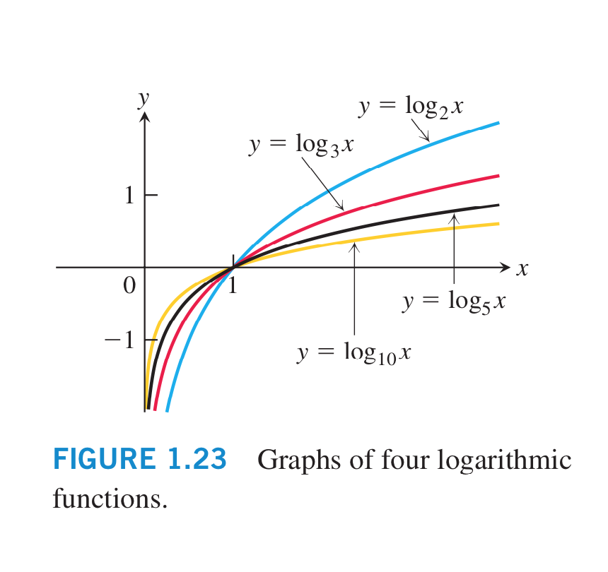
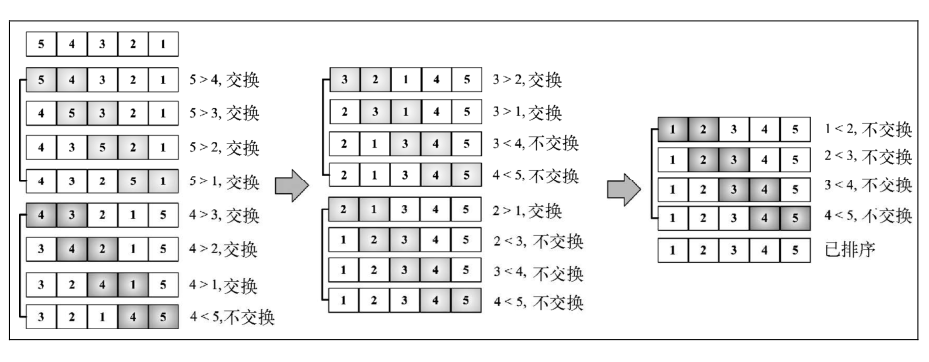
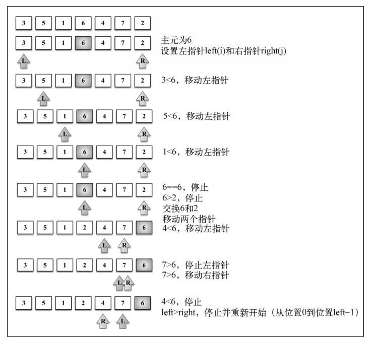
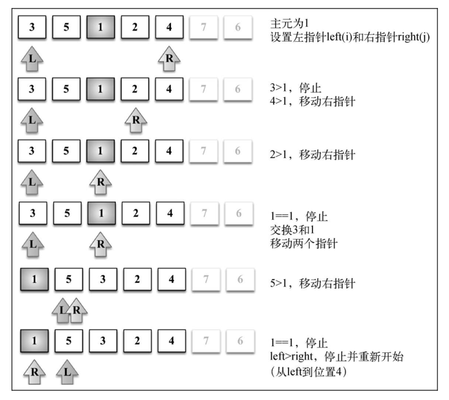
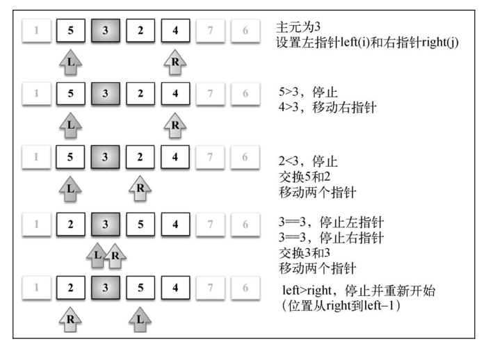
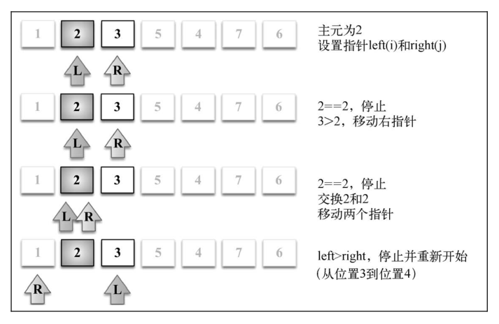
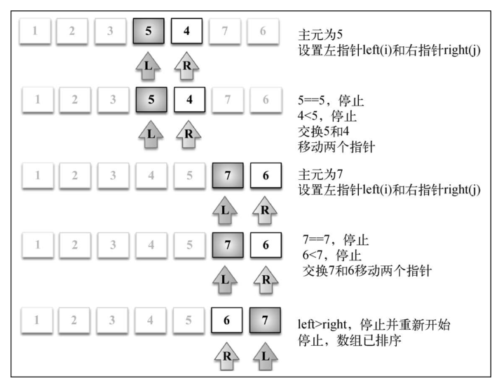

# 第 13 章 -- 排序与搜索算法

## 本章目录 (Catalog)
- 13.1 排序算法
    + 13.1.1 冒泡排序 (Bubble Sort)
    + 13.1.2 选择排序 (Selection Sort)
    + xx.x.x 堆排序 (Heap Sort)
    + 13.1.3 插入排序 (Insertion Sort)
    + xx.x.x 希尔排序 (Shell Sort)
    + 13.1.4 归并排序 (Merge Sort)
    + 13.1.5 快速排序 (Quick Sort)
    + 13.1.6 计数排序 (Counting Sort)
    + 13.1.7 桶排序 (Bucket Sort)
    + 13.1.8 基数排序 (Radix Sort)
- 13.2 搜索算法
    + 13.2.1 顺序搜索
    + 13.2.2 二分搜索
    + 13.2.3 内插搜索
- 13.3 随机算法
    + Fisher-Yates 随机
- 13.4 小结    


## 生词 (New Words)
- **insertion [ɪn'sɜːʃ(ə)n] --n.插入; 插入物**
    + The insertion of a line or two into the script.  
      在书稿中插入一两行.
    + Sometimes the insertion of one word can change the meaning of a whole
      sentence.  有时插入一个字可以改变全句的意义.
- **pivot ['pɪvət] --n.枢纽, 中心点**
    + pivot point: 枢轴点, 旋转点, 支点
- **partition [pɑː'tɪʃ(ə)n]--n.分开，分割  --vt.分开，分割**   
- **logarithmic [ˌlɔɡə'riðmik] --adj.对数的**
    + Logarithmic functions 对数函数
- **computational [ˌkɑmpju'teʃənl] --adj.计算的**
    + computational errors. 计算错误
    + He turns to computational aids for help. 他运用计算工具.   
- **complexity [kəm'pleksətɪ] --n.复杂，复杂性**
    + complexity analysis 复杂度分析
    + There was lots of complexity built into his being. 有很多复杂因素构成了他这个人。
    + the complexities of family life. 家庭生活中的复杂因素。
- **binary ['baɪnərɪ] --adj.二进制的，二元的。**
    + It is stored as a binary file. 它以二进制格式文件存储。
    + a data file in binary format. 二进制格式的数据文件。
- **shuffle ['ʃʌf(ə)l] --v.拖拽，洗(牌)。 --n. 洗牌**
    + You can take some cards and shuffle. 你可以拿一些牌然后洗一下。


## 补充内容 (From the Internet)
#### 4 种常见对数图
- 
    + Note: 截图来自 "托马斯大学微积分"
#### 算法概述
> [文章来源](https://www.cnblogs.com/onepixel/p/7674659.html)
- 01 算法分类:
    + 10 种常见排序算法可以分为 2 大类:
        - (1) 比较类排序: 通过比较来决定元素间的相对次序, 由于其时间复杂度不能突破
          $O(n\log_{2}{n})$(简写: $O(n\log{n}$. Tip: $\log_{10}{n}$ 简写为
          $\lg{n}$), 因为也称为非线性时间比较类排序.
        - (2) 非比较类(线性时间)排序: 不通过比较来决定元素间的相对次序,
          它可以突破基于比较排序的时间下界, 以线性时间运行, 因此也称为线性时间非比较类排序. 
            + 线性时间: 
                    
- 02 算法复杂度: 
  |排序法|(平均)时间复杂度|(最坏)时间复杂度|(最好)时间复杂度|空间复杂度|w稳定性|
  |:------:|:------:|:------:|:------:|:------:|:------:|
  |**比较类排序**|...|...|...|...|...|
  |`13.1.1 冒泡排序`| $O(n^2)$|$O(n^2)$|$O(n)$|$O(n)$|稳定|
  |`13.1.2 选择排序`| $O(n^2)$|$O(n^2)$|$O(n^2)$|$O(1)$|稳定|
  |`xx.x.x 堆排序`|$O(n\log_{2}{n})$|$O(n\log_{2}{n})$|$O(n\log_{2}{n})$|$O(1)$|不稳定|
  |`13.1.3 插入排序`| $O(n^2)$|$O(n^2)$|$O(n)$|$O(1)$|稳定|
  |`xx.x.x 希尔排序`| $O(n^{1.3})$|$O(n^2)$|$O(n)$|$O(1)$|不稳定|
  |`13.1.4 归并排序`|$O(n\log_{2}{n})$|$O(n\log_{2}{n})$|$O(n\log_{2}{n})$|$O(n)$|稳定|
  |`13.1.5 快速排序`|$O(n\log_{2}{n})$|$O(n^2)$|$O(n\log_{2}{n})$|$O(n\log_{2}{n})$|不稳定|
  |**非比较排序**|...|...|...|...|...|
  |`13.1.6 计数排序`| $O(n + k)$ | $O(n + k)$ | $O(n + k)$ | $O(n + k)$ | 稳定 |
  |`13.1.7 桶排序` | $O(n + k)$ | $O(n^2)$ | $O(n)$ | $O(n + k)$ | 稳定 |
  |`13.1.8 基数排序`| $O(n * k)$ | $O(n * k)$ | $O(n * k)$ | $O(n + k)$ | 稳定 |
- 03 时间复杂度:
    + 在计算机科学中, 算法的时间复杂度 (Time Complexity) 是一个函数, 它定性描述该算法
      的运行时间. 这是一个代表算法输入值的字符串的长度的函数. 时间复杂度常用 `大 O 符号`
      表述, 不包含这个函数的低阶项和首相系数. 使用这种方式时, 时间复杂度可被称为是渐近的,
      亦即考察输入值大小趋近无穷时的情况. 例如, 如果一个算法对于任何大小为 n (必须比 
      $n_0$)大的输入, 它至多需要 $5n^3 + 3n$ 的时间运行完毕, 那么它的渐进时间复杂度
      是 $O(n^3)$.
      
      为了计算时间复杂度, 我们通常会估计算法的操作单元数量, 每个单元运行的时间都是相同的.
      因此, 总运行时间和算法的操作单元数量最多相差一个常量系数.
      
      相同大小的不同输入值仍可能造成算法的运行时间不同, 因此我们通常使用算法的最坏
      情况复杂度(Worst-case complexity) 记为**T(n)**, 定义为任何大小的输入 $n$
      所需的最大运行时间.

      常见函数的时间复杂度(Time complexity)表:    
      
         
- 04 相关概念:
    + **稳定**：如果 a 原本在 b 前面，而 a = b，排序之后 a 仍然在 b 的前面。
    + **不稳定**：如果 a 原本在 b 的前面，而 a = b，排序之后 a 可能会出现在 b 的后面。
    + **时间复杂度**：对排序数据的总的操作次数。反映当 n 变化时，操作次数呈现什么规律。
    + **空间复杂度**: 是指算法在计算机内执行时所需存储空间的度量, 它也是数据规模 n 的函数.


## 本章内容 (Content)
### 13.1 排序算法
#### 13.1.1 冒泡排序 (Bubble Sort)
- 冒泡排序是排序算法中最简单的, 然而, 从运行时间的角度来看, 冒泡排序是最差的一个.
- 冒泡排序比较所有相邻的 2 个项, 如果第 2 个比第 1 个大, 则交换它们. 元素向上移动至正确
  的顺序, 就好像气泡升至表面一样, 冒泡排序因此得名.
- 冒泡排序的源码: `01_bubble-sort.html`
  下图展示了冒泡排序的工作过程:  
    
  该示意图中每一小段表示外循环的一轮({2}), 而相邻两项的比较则是在内循环中进行的({3}).  
  我们使用下面这段代码来测试冒泡排序算法, 看看结果是否和示意图所示一致.
  ```js
    let array = [5, 4, 3, 2, 1];
    // - join(): 只接受一个参数, 即用作分隔符的字符串, 然后返回包含所有数组项的字符串.
    console.log(array.join());  // 5, 4, 3, 2, 1
    let arr = bubbleSort(array);
    console.log("arr: ", arr);  // arr: [1, 2, 3, 4, 5]
  ```
  注意当算法执行外循环(for)的第二轮时, 数字 6 和 7 都已经是正确排序的了. 尽管如此, 
  在后续比较中, 它们还是在一直进行着比较, 即使这是不必要的. 因此, 我们可以稍微改进
  一下冒泡排序算法.
- **改进后的冒泡排序**
    + 如果从内循环减去外循环中已跑过的轮数, 就可以避免内循环中所有不必要的比较({1}).
      ```js
        const Compare = {
            LESS_THAN: -1,
            BIGGER_THAN: 1,
            EQUALS: 0
        };
        function defaultCompare(a, b) {
            if (a === b) {
                return Compare.EQUALS;
            }
            return a < b ? Compare.LESS_THAN : Compare.BIGGER_THAN;
        }
        function swap(array, a, b) {
            const temp = array[a];
            array[a] = array[b];
            array[b] = temp;
            // - ES6 的方式
            // [array[a], array[b]] = [array[b], array[a]]
        }
        function modifiedBubbleSort(array, compareFn = defaultCompare) {
            const {length} = length;
            for (let i = 0; i < length; i++) {
                for (let j = 0; j < length - 1 - i; j++) {  // {1}
                    if (compareFn(array[j], array[j +1]) 
                        === Compare.BIGGER_THAN) {
                        swap(array, j, j+1);
                    }
                }
            }
            return array;
        }
      ```
    + 下面这个示意图展示了改进后的冒泡排序算法是如何执行的.  
        
    + 注意, 已经在正确位置上的数字没有被比较. 即便我们做了这个小改变来改进冒泡排序算法, 但
      还是不推荐该算法, 它的复杂度为 $O(n^2)$.  
    + 我们将在第 15 章详细介绍大 $O$ 表示法, 对算法做更多的讨论.
#### 13.1.2 选择排序 (Selection Sort)
- 选择排序算法是一种`原址比较`排序算法. 选择排序大致的思路是:
  **找到数据结构中的最小值并将其放置在第一位, 接着找到第二小的值并将其放在第二位**, 以此类推.
    + 下面是选择排序算法的源代码: `02_selection-sort.html`
    + 测试代码同上.
    + 下面的示意图展示了选择排序算法, 此例基于之前代码中所用的数组, 也就是 [5, 4, 3, 2, 1].
        
    + 数组底部的箭头指示出当前迭代轮寻找最小值的数组范围 (内循环——{4}), 示意图中的每一步
      则表示外循环({2}). Tip: 执行语句为中间 4 行, 因为外 for 循环语句 length - 1 = 4.
    + 选择排序同样也是一个复杂度为 $O(n^2)$ 的算法。和冒泡排序一样, 它包含有嵌套的两个循环
      , 这导致了二次方的复杂度。然而, 接下来要学的插入排序比选择排序性能要好。
#### 13.1.3 插入排序 (Insertion Sort)
- 插入排序: `每次排一个数组项`, 以此方式构建最后的排序数组. `假定第一项已经排序了`. 接着,
  它和第 2 项进行比较 -- 第 2 项是应该待在原位还是插到第 1 项之前? 这样, 头两项就已正确排序,
  接着和第三项比较 (它是该插入到 第一, 第二 还是第三 的位置呢), 以此类推.
- 下面这段代码表示插入排序算法: `03_insertion-sort.html`
    + 下面的示意图展示了一个插入排序的实例.  
      
    + 举个例子, 假定待排序数组是 [3, 5, 1, 4, 2] 。这些值将被插入排序算法按照下面
      的步骤进行排序。
        - (1) 3 已被排序, 所以我们从数组第二个值 5 开始。3 比 5 小，所以 5 待在原位
          (数组的第二位)。3 和 5排序完毕。
        - (2) 下一个待排序和插到正确位置上的值是 1（目前在数组的第三位）。5 比 1 大，
          所以 5 被移至第三位去了。我们得分析 1 是否应该被插入到第二位——1比 3大吗？不，
          所以 3被移到第二位去了。接着，我们得证明 1应该插入到数组的第一位上。因为 0 是
          第一个位置且没有负数位，所以 1必须被插入第一位。1、3、5三个数字已经排序。
        - (3) 然后看下一个值：4。4 应该在当前位置（索引 3）还是要移动到索引较低的位置上
          呢？4 比 5 小，所以 5 移动到索引 3 位置上去。那么应该把 4 插到索引 2 的位置
          上去吗？4 比 3 大，所以把 4 插入数组的位置 3上。
        - (4) 下一个待插入的数字是 2（数组的位置 4）。5 比 2 大，所以 5 移动至索引 4。
          4 比 2 大，所以 4也得移动（位置 3）。3 也比 2大，所以 3 还得移动。1 比 2小，
          所以 2 插入到数组的第二位置上。至此，数组已排序完成。
    + 排序小型数组时，此算法比选择排序和冒泡排序性能要好。  
#### 13.1.4 归并排序 (Merge Sort)
- 归并排序**是第一个可以实际使用的**排序算法. 你在本书学到的前三个排序算法性能不好, 但归并
  排序性能不错, 其算法复杂度为 $O(n\log{(n)})$.
- Note: JavaSscirpt 的 Array 类定义了一个 sort 函数 (`Array.prototype.sort`)
  用以排序 JavaScript 数组 (我们不必自己实现这个算法). ECMAScript 没有定义用哪个
  排序算法, 所以浏览器厂商可以自行去实现算法. 例如, Mozilla Firefox 使用了归并排序
  作为 Array.prototype.sort 的实现, 而 Chrome (V8 引擎) 使用了一个快速排序的变体
  (下面我们会学习).
    + Tip01: 从上面的 `02 算法复杂度` 的表格可以看出, 归并排序和下一节(13.1.5)要讲的
      `快速排序` 在复杂度上只有 "(最坏)时间复杂度" 和 "空间复杂度" 的不同, 归并排序的 
      最坏时间复杂度是 $O(n\log{n})$ 而 快速排序的时间复杂度可能达到 $O(n^2)$
      , $n^2$ 这个指数级的时间就很恐怖了; 对比一下空间复杂度, 归并排序是 $O(n)$, 虽然
      比快速排序的 $O(n\log{n})$ 是差一些, 但是这点差距和在 最坏时间复杂度的差距
      比起来,性能就要好太多了, 书上说 Chrome V8 用了一个快速排序的变体, 到底是如何实现
      的, 还需要后续查资料才知道, 待解答?!
    + Tip02: Array.prototype.sort 的使用示例见: 仓库 `JS-book-learning\`
      `《Javascript设计模式与编程实践》\第一部分--基础知识\第3章-闭包和高阶函数\`
      `第3章--闭包和高阶函数.md`
- 归并排序是一种分而治之算法. 其思想是将原始数组切分成较小的数组, 直到每个小数组只有一个位置,
  接着将小数组归并成较大的数组, 直到最后只有一个排序完毕的大数组.
- 由于是分治法, 归并排序也是递归(recursive, `chapter09-递归`)的. 我们要将算法分为
  2 个函数: 第 1 个(`mergeSort`)负责将一个大数组分为多个小数组并调用用来排序的辅助函数
  (`merge`). 我们来看看在这里声明的主要函数: `04_merge-sort.html`
  如果执行 mergeSort 函数, 下图是具体的执行过程.  
    
  可以看到, 算法首先将原始数组分割直至只有一个元素的子数组, 然后开始归并. 归并过程也会完成
  排序, 直至原始数组完全合并并完成排序. 
- Added: 归并排序算法分析 -- 归并排序是一种稳定的排序方法. 和选择排序一样, 归并排序的性能
  不受输入数据的影响, 但表现比选择排序好的多, 因为始终都是 $O(n\log{n})$ 的时间复杂
  度. 代价是需要额外的内存空间.  
#### 13.1.5 快速排序 (Quick Sort)
- 快速排序也许是最常用的排序算法了. 它的复杂度为 $O(n\log{(n)})$, 且性能通常比
  其他复杂度为 $O(n\log{(n)})$ 的排序算法要好. 和归并排序一样, 快速排序也使用
  分而治之的方法, 将原始数组分为较小的数组(但它并没有像归并排序那样将他们分割开).
    + 快速排序比目前学过的其他排序算法要复杂一些.
    + (1) 首先, 从数组中选择一个值作为 `主元/基准(pivot)`, 也就是数组中间的那个值. 
    + (2) 创建 2 个指针(引用), left 指向数组第一个值的索引, right 指向数组最后
      一个值的索引. 移动左指针直到我们找到一个比主元大的值, 接着, 移动右指针直到找到
      一个比主元小的值,然后交换它们, 重复这个过程, 直到左指针超过了右指针. 这个过程将使
      得比主元小的值都排在主元之前, 而比主元大的值都排在主元之后. 这一步叫作 
      **划分(partition)** 操作.
    + (3) 接着, 算法对划分后的小数组(较主元小的值组成的子数组, 以及较主元大的值组成的子数
      组) 重复之前的 2 个步骤, 直至数组已完全排序.
- 快速排序的实现源码: `05_quick-sort.html`
- 2. 快速排序实战: 
    + 让我们来一步一步看一个快速排序的实际例子.
        
    + 给定数组 [3, 5, 1, 6, 4, 7, 2], 前面的示意图展示了划分操作的第一次执行.  
    + 下面的示意图展示了对有较小值得子数组执行的划分操作(注意 7 和 6 不包含在子数组之内.)
        
    + 接着, 我们继续创建子数组, 如下图所示, 但是这次操作是针对上图中有较大值得子数组(有
      1 的那个较小子数组不用再划分了, 因为它仅含有一个值.)
        
    + 对子数组 [2, 3, 5, 4] 中的较小子数组 [2, 3] 继续进行划分 (算法代码中的行 {5})
                            
    + 然后子数组 [2, 3, 5, 4] 中的较大子数组 [5, 4] 也继续进行划分 (算法中的行 {7}), 
      示意图如下:
            
    + 最终, 较大子数组 [6, 7] 也会进行划分操作, 快速排序算法的操作执行完成.
#### 13.1.6 计数排序 (Counting Sort)
- 计数排序是我们在本书中学习的第一个分布式排序。分布式排序使用已组织好的辅助数据结构
 （称为桶），然后进行合并，得到排好序的数组。计数排序使用一个用来存储每个元素在原始数组
  中出现次数的临时数组。在所有元素都计数完成后，临时数组已排好序并可迭代以构建排序后的
  结果数组.
- 它是用来排序整数的优秀算法(它是一个**整数排序算法**), 时间复杂度为 $O(n+k)$, 其中
  $k$ 是临时计数数组的大小; 但是, 它确实需要更多的内存来存放临时数组.
- 如果待排序的数组为空或只有一个元素（行{1}），则不需要运行排序算法。
- 对于计数排序算法，我们需要创建计数数组，从索引 0 开始直到最大值索引 value + 1
 （行{3}）。因此，我们还需要找到数组中的最大值（行{2}）。要找到数组中的最大值，
  我们只需要迭代并找到值最大的一项即可.
- 然后，我们迭代数组中的每个位置并在 counts 数组中增加元素计数值（行{5}）。为了
  确保递增操作成功，如果 counts 数组中用来计数某个元素的位置一开始没有用 0 初始化
  的话，我们将其赋值为 0（行{4}）。
- 所有元素都计数后，我们要迭代 counts 数组并构建排序后的结果数组。由于可能有多个
  元素有相同的值，我们要将元素按照在原始数组中的出现次数进行相加。我们要减少计数值
 （行{8}）直到它的值为零（行{6}），将值（ i）加入结果数组。因此，还需要一个辅助
  索引 (sortedIndex) 帮助我们将值赋值到结果数组中的正确位置.  
- 下面的代码表示计数排序算法: `06_counting-sort.html`  
#### 13.1.7 桶排序 (Bucket Sort)
#### 13.1.8 基数排序 (Radix Sort)

### 13.2 搜索算法 (7 大查找算法)
#### 13.2.1 顺序搜索
#### 13.2.2 二分搜索
- 二分搜索算法的原理和猜数字游戏类似，就是那个有人说“我正想着一个 1～100 的数”的游戏。
  我们每回应一个数，那个人就会说这个数是高了、低了还是对了.
- 这个算法要求被搜索的数据结构已排序。以下是该算法遵循的步骤。
    + (1) 选择数组的中间值。
    + (2) 如果选中值是待搜索值，那么算法执行完毕（值找到了）。
    + (3) 如果待搜索值比选中值要小，则返回步骤 1 并在选中值左边的子数组中寻找（较小）。
    + (4) 如果待搜索值比选中值要大，则返回步骤 1 并在选种值右边的子数组中寻找（较大）。
- 以下是源码实现: `13.2.2_binary-search.html` 
#### 13.2.3 内插搜索
- 内插搜索是改良版的二分搜索。二分搜索总是检查 mid 位置上的值，而内插搜索可能会根据要
  搜索的值检查数组中的不同地方。
- 这个算法要求被搜索的数据结构已排序。以下是该算法遵循的步骤：
    + (1) 使用 position 公式选中一个值；
    + (2) 如果这个值是待搜索值，那么算法执行完毕（值找到了）；
    + (3) 如果待搜索值比选中值要小，则返回步骤 1 并在选中值左边的子数组中寻找（较小）；
    + (4) 如果待搜索值比选中值要大，则返回步骤 1 并在选种值右边的子数组中寻找（较大）。
- 以下是源码实现: `13.2.3_interpolation-search.html`
#### (4) 斐波那契查找
- [详见](https://zhuanlan.zhihu.com/p/64940290)
#### (5) 树表查找
- (5.1) 最简单的树表查找算法 -- 二叉树查找算法
- (5.2) 平衡查找树之 -- 2-3 查找树 (2-3 Tree)
- (5.3) 平衡查找树之 -- 红黑树 (Red-black Tree)
- (5.4) B 树 和 B+ 树 (B Tree / B+ Tree)
#### (6) 分块查找 -- 分块查找又称 "索引顺序查找", 它是顺序查找的一种改进方法.
#### (7) 哈希查找

### 13.3 随机算法
- 有一种场景是需要将一个数组中的值进行随机排列. 现实中的一个常见场景是洗扑克牌.
  下面我们学习随机数组的一种最有名的算法
#### Fisher-Yates(费舍尔·耶茨) 随机
- 这个算法由 Fisher 和 Yates 创造, 并由高德纳 (Donald E.Knuth) 在
 《计算机程序设计艺术》系列图书中推广.
- 它的含义是迭代(iteration)数组, 从最后一位开始并将当前位置和一个随机位置进行交换. 
  这个随机位置比当前位置小. 这样, 这个算法可以保证随机过的位置不会再被随机一次(洗扑克
  牌的次数越多, 随机效果越差).
- 下面的代码展示了 Fisher-Yates 随机算法
  ```js
    function swap(array, a, b) {
        const temp = array[a];
        array[a] = array[b];
        array[b] = temp;
        // - ES6 的写法
        // [array[a], array[b]] = [array[b], array[a]];
    }
    function shuffle(array) {
        for (let i = array.length; i > 0; i--) {
            const randomIndex = Math.floor(Math.random() * (i + 1));
            swap(array, i, randomIndex);
        }
        return array;
    }
  ```

### 13.4 小结    


