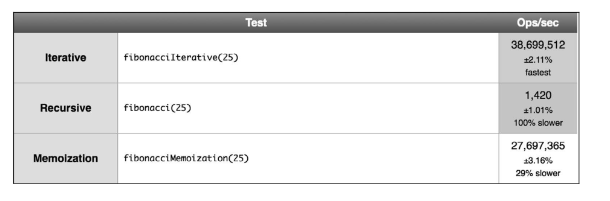

# 第 9 章 -- 递归

## 本章目录 (Catalog)
- 9.1 理解递归 
- 9.2 计算一个数的阶乘
    + 9.2.1 迭代阶乘
    + 9.2.2 递归阶乘
- 9.3 斐波那契数列
    + 9.3.1 迭代求斐波那契数
    + 9.3.2 递归求斐波那契数
    + 9.3.3 记忆化斐波那契数
- 9.4 为什么要用递归? 它更快吗
- 9.5 小结

## 生词 (New Words)
- **recursive [rɪ'kɜːsɪv] --adj.递归的；循环的** 
    + recursive algorithm 递归算法
    + recursive function 递归函数
- **iterative ['ɪt(ə)rətɪv] --adj.迭代的, 反复的**
    + It's an iterative design and development. 这是个反复的设计和发展.
- **iteration [ˌɪtə'reɪʃn] --n.迭代，重复，反复**
    + Let's listen to the next iteration of this theme. 我们来听下一段主题。
    + So this process takes about four or five iterations.
        这个过程需要四到五此反复。
    + Iterators are just objects with a specific interface designed for 
        iteration. 迭代器是一种特殊对象，它具有一些专门为迭代过程设计的专有接口。  
- **memorization [ˌmɛmərɪ'zeʃən] --n.记住, 默记**
    + It can be so much more than just memorization and retention.  
      学习知识不应该知识透过死记硬背的方式.
    + retention [rɪ'tenʃ(ə)n] --n.保留, 保持.  

## 本章内容 (Content)
### 9.1 理解递归 

### 9.2 计算一个数的阶乘
- 9.2.1 迭代(iterator) 阶乘
    + ```javascript
        function factorialIterative(number) {
            if (number < 0) {return undefined;}
            let total = 1;
            for (let n = number; n > 1; n--) {
                total = total * n;
            }
            return total;
        }
        console.log(factorialIterative(5)); // 120
      ```
- 9.2.2 递归(recursive) 阶乘
    + 现在我们试着用递归来重写 factorialIterative 函数，但是首先使用递归的定义来
      定义所有的步骤。
    + 5 的阶乘用 `5 × 4 × 3 × 2 × 1` 来计算。 4($n - 1$) 的阶乘用 `4 × 3 × 2 × 1`
      来计算。计算 $n -1$ 的阶乘是我们计算原始问题 $n!$ 的一个子问题，因此可以像下面这样
      定义 5 的阶乘。
        - (1) factorial(5) = 5 * factorial(4)：我们可以用 $5 × 4!$ 来计算 $5!$。
        - (2) factorial(5) = 5 * (4 * factorial(3))：我们需要计算子问题 $4!$，
          它可以用 $4 × 3!$ 来计算。
        - (3) factorial(5) = 5 * 4 * (3 * factorial(2))：我们需要计算子问题 $3!$,
          它可以用 $3 × 2!$ 来计算。
        - (4) factorial(5) = 5 * 4 * 3 * (2 * factorial(1))：我们需要计算子问题
          $2!$, 它可以用 $2 × 1!$ 来计算。
        - (5) factorial(5) = 5 * 4 * 3 * 2 * (1)：我们需要计算子问题 $1!$。
        - (6) factorial(1)或 factorial(0)返回 1。 $1!$ 等于 1。我们也可以说 
          $1! = 1 × 0!$, $0!$ 也等于 1。
    + 使用递归的 factorial 函数如下:
      ```javascript
        function factorial(n) {
            // - 基线条件
            if (n === 1 || n === 0) { return 1;}
            // - 递归调用
            return n * factorial(n -1);
        }
        console.log(factorial(5));  // 120
      ```
    + **1. 调用栈** (chapter04-栈(stack): 后进先出 LIFO )
        - 我们在第 4 章学习了栈数据结构。我们来看看在实际应用中用递归形式使用它的例子。
          每当一个函数被一个算法调用时，该函数会进入调用栈的顶部。`当使用递归的时候`，
          `每个函数调用都会堆叠在调用栈的顶部，这是因为每个调用都可能依赖前一个调用的结果。`
        - 我们可以用浏览器看到调用栈的行为，如下图所示。  
                 
        - 当 factorial(1) 返回 1 时, 调用栈会开始弹出调用, 返回结果, 直到 
          3 * factorial(2) 被计算.
        - **Note**: 根据上图我们可以看出, 当调用 factorial(3) 时, 浏览器调试器中的
          `Call Stack(执行栈)` 中保存的顺序是: 
          `[factorial(3), factorial(2), factorial(1)]`, 可以看出 factorial(1)
          是在栈顶的, 最后当我们执行 `调用栈` 中的代码时, 栈顶的 factorial(1) 先被推出.
          即下面的执行过程.
            + (1) factorial(1) --(弹出)--> 1 = 1
            + (2) factorial(2) --(弹出)--> 2 * 1 = 2
            + (3) factorial(3) --(弹出)--> 3 * 2 = 6
            + 完毕后返回 6    
    + **2. Javascript 调用栈大小的限制**
        - 如果忘记加上用于停止函数递归调用的基线条件, 会发生什么呢? 递归并不会无限地执行
          下去, 浏览器会抛出错误, 也就是所谓的 **栈溢出错误(stack overflow error)**
        - 每个函数都有自己的上限, 可用以下代码测试:
          ```javascript
            let i = 0;
            function recursiveFn() {
                i++;
                recursiveFn();    // - 加粗
            }
            try {
                recursiveFn();
            } catch (ex) {
                console.log('i = ' + i + ' error: ' + ex);
            }
          ```
        - ECMAScript 2015有尾调用优化（tail call optimization）。如果函数内的
          最后一个操作是调用函数（就像示例中加粗的那行），会通过“跳转指令”（jump）而不是
          “子程序调用”（subroutine call）来控制。也就是说，在 ECMAScript 2015 中，
          这里的代码可以一直执行下去。因此，具有停止递归的基线条件非常重要。
            + 有关尾调用优化的更多相关信息，请访问 
              https://www.chromestatus.com/feature/5516876633341952

### 9.3 斐波那契数列
- **斐波那契数列**是另一个可用递归解决的问题. 它是一个由 
  `0, 1, 1, 2, 3, 5, 8, 13, 21, 34` 等数组成的序列. 数 2 由 1 + 1 得到, 数 3 由 
  2 + 1 得到, 数 5 由 2 + 3 得到, 以此类推. 斐波那契数列的定义如下:
    + (1) 位置 0 的斐波那契数是 0.
    + (2) 1 和 2 的斐波那契数是 1.
    + (3) n (n > 2) 的斐波那契数是 (n - 1) 的斐波那契数加上 (n - 2) 的斐波那契数.
- 9.3.1 迭代(Iterative)求斐波那契数
    + ```javascript
        // - 迭代求斐波那契数
        function fibonacciIterative(n) {
            if (n < 1) {return 0;}
            let fibNMinus2 = 0;
            let fibNMinus1 = 1;
            let fibN = n;
            for (let i = 2; i <= n; i++) {
                fibN = fibNMinus1 + fibNMinus2;
                fibNMinus2 = fibNMinus1;
                fibNMinus1 = fibN;
                console.log("fibN:", fibN);
            }
            return fibN;
        }
        // console.log(fibonacciIterative(16));
      ```
- 9.3.2 递归(Recursive)求斐波那契数
    + ```javascript
        function fibonacci(n) {
            if (n < 1){
                return 0;
            }
            if (n <= 2) {
                return 1;
            }
            // - Tip: 这里的执行栈和 9.2.2 递归的 调用栈 是一样的道理.
            return fibonacci(n - 1) + fibonacci(n - 2);
        }
        console.log(fibonacci(6));
      ```
- 9.3.3 记忆化(Memorization)斐波那契数
    + ```javascript
        function fibonacciMemorization(n) {
            if (n < 1) {return 0;}
            const memo = [0, 1];
            const fibonacciMem = num => {
                if (memo[num] != null) {return memo[num];}
                return (memo[num] = fibonacciMem(num -1) + fibonacciMem(num -2));
            };
            return fibonacciMem(n);
        }
        // console.log(fibonacciMemorization(6));
      ```

### 9.4 为什么要用递归(recursive)? 它更快吗
- 我们运行一个检测程序来测试本章 3 种不同的 fibonacci 函数:  
  
- 迭代(iterative) 的版本的版本比 递归(recursive, 第 2 行) 快很多, 所以这表示递归更慢.
  但是, 再看看 3 个不同版本的代码. 递归版本更容易理解, 需要的代码通常也更少. 另外, 对一些
  算法来说, 迭代的解法可能不可用, 而且有了尾调用优化, 递归的多余消耗甚至可能被消除.
- 所以, 我们经常使用递归, 因为用它来解决问题会更简单.

### 9.5 小结
