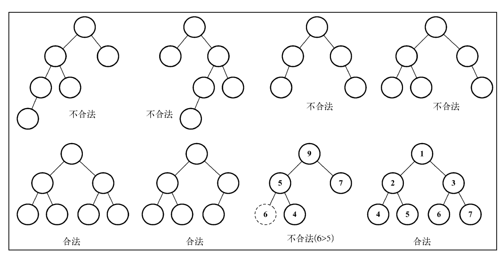
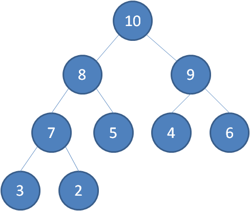

# 第 11 章 -- 二叉堆(Binary Heap) 和 堆排序(Heap Sort)

## 本章目录 (Catalog)
- 11.1 二叉堆数据结构
    + 11.1.1 创建最小堆类
    + 11.1.2 创建最大堆类
- 11.2 堆排序算法
- 11.3 小结


## 生词 (New Words)
- **heap [hiːp] --n.累积; 堆; 许多. --vt.堆积. --vi.堆起来**
    + in a heap(n) = in heaps. 成山, 成堆, 许多
    + You do know a heap of people, don't you? 你认识很多人, 不是吗?
    + Heaps of times. 屡次, 多次
    + There is heaps of time. 有充裕的时间.
    + heap(vt) up riches. 累积财富.
    + heap (up) stones. 堆积石头
- **extract [ɪk'strækt] --vt.提取，摘录**
    + CSS extract plugin. css 提取插件
- **minimum ['mɪnɪməm] --n.最小量; 最小值; 最小化.  --adj.最小化; 最低的**    
- **sift [sɪft] --v.筛, 过滤**
    + sift(vt) sand. 筛沙
    + sift(vt) (out) pebbles from sand. 从沙中筛出小石头
    + Light sifted through a chink in the wall. 光线从墙缝摄入.
- **percolate ['pɜːkəleɪt] --vi.过滤, 渗透. --vt.(用渗滤壶)煮(咖啡), 渗滤**
    + I'll percolate some coffee for you. 我给你滤煮一些咖啡.
- **heapify --堆化**
- **cascade [kæs'keɪd] --n.级联; 小瀑布.**


## 添加内容(Added Content)
> [来源-维基百科](https://zh.wikipedia.org/zh-cn/%E5%A0%86%E7%A9%8D)
### 堆 (Heap)
- 堆 (英语: Heap) 是计算机科学中一种特别的树状数据结构. 若满足以下特性，即可称为堆:
    + "给定堆中任意节点P和C，若P是C的母节点，那么P的值会小于等于（或大于等于）C的值".
      若母节点的值恒小于等于子节点的值，此堆称为最小堆 (min heap); 反之，若母节点的值
      恒大于等于子节点的值，此堆称为最大堆 (max heap). 在堆中最顶端的那一个节点，称作
      根节点(root node), 根节点本身没有母节点 (parent node).
- 堆 始于 J.W.J.Williams 在 1964 年发表的堆排序(heap sort), 当时他提出了二叉堆
  作为此算法的数据结构. 堆在 Dijkstra's algorithm (迪杰斯特拉算法) 中亦为重要的
  关键. (Tip:  12.5.1 Dijkstra(迪杰斯特拉) 算法  )
- 在队列中, 调度程序返回提取队列中第一个作业并运行, 因为实际情况中某些时间较短的任务
  将等待很长时间才能结束, 或者某些不短小, 但具有重要性的作业, 同样也当具有优先权.
  堆即为解决此类问题设计的一种数据结构.
### 性质: 
- 堆的实现通过构造二叉堆 (binary heap), 实为二叉树的一种; 由于其应用的普遍性，
  当不加限定时，均指该数据结构的这种实现。这种数据结构具有以下 2 个性质。
    + (1) 
    + (2) 见下面 11.1 
### 支持的基本操作:
- |操作|描述|时间复杂度|
  |:---|:---|:---|
  |build  | 创建一个空堆 |	$0(n)$|
  |insert | 向堆中插入一个新元素|	$0(\log_{2}{n})$|
  |update | 将新元素提升使其符合堆的性质||
  |get	  | 获取当前堆顶元素的值|	$0(1)$|
  |delete | 删除堆顶元素|	{$0(\log_{2}{n})$|
  |heapify| 使删除堆顶元素的堆再次成为堆||


## 本章内容 (Content)
- 在上一章，我们学习了树数据结构。在本章中，我们将要学习一种特殊的二叉树，也就是`堆数据结构`
  , 也叫作`二叉堆`。二叉堆是计算机科学中一种非常著名的数据结构，由于它能高效、快速地找出
  **最大值**和**最小值**，常被应用于**优先队列**。它也被用于著名的 `堆排序算法` 中。

### 11.1 二叉堆数据结构
- 二叉堆是一种特殊的二叉树，有以下 2 个特性。
    + (1) 它是一棵 `完全二叉树`，即树的每一层都有左侧和右侧子节点（除了最后一层的
      叶节点）, 并且最后一层的叶节点尽可能都是左侧子节点，这叫作`结构特性`。
    + (2) 二叉堆不是最小堆就是最大堆。最小堆允许你快速导出树的最小值，最大堆允许你快速
      导出树的最大值。所有的节点都大于等于（最大堆）或小于等于（最小堆）每个它的子节点。
      这叫作`堆特性`。
- 下图展示了一些合法的和不合法的堆.  
     
  尽管二叉堆是二叉树, 但并一定是二叉搜索树 (BST). 在二叉堆中, 每个子节点都要大于等于
  父节点(最小堆) 或 小于等于父节点(最大堆). 然而在二叉搜索树中, 左侧子节点总是比父节点小,
  右侧子节点也总是更大. 
#### 11.1.1 创建最小堆类
- [漫画: 什么是二叉堆?](https://www.itcodemonkey.com/article/8660.html)
    + 二叉堆本质上是一种完全二叉树，它分为两个类型：
        - (1) **最大堆**
          - 最大堆是任何一个父节点的值, 都大于等于它左右孩子节点的值.  
            
        - (2) **最小堆**
          - 最小堆是任何一个父节点的值, 都小于等于它左右孩子节点的值.  
            
        - **堆顶**: 二叉堆的根节点叫做堆顶.
        - 最大堆和最小堆的特点, 决定了在最大堆的堆顶是整个堆中的最大元素; 最小堆的
          堆顶是整个堆中的最小元素.
    + 二叉堆虽然是一颗完全二叉树, 但它的存储方式并不是链式存储, 而是顺序存储. 换句话说, 
      二叉堆的**所有节点都存储在数组当中.**   
    + ...... 
- **1. 二叉树的数组表示**
    + 二叉树有两种表示方式。第一种是使用一个动态的表示方式，也就是指针（用节点表示），在
      上一章使用过。第二种是使用一个数组，通过索引值检索父节点、左侧和右侧子节点的值。
      下图展示了两种不同的表示方式。
    + 要访问使用普通数组的二叉树**节点**，我们可以用下面的方式操作 index. 对于给定位置
      index 的节点：
        - 它的左侧子节点的下表(index)位置是 2 * index + 1 (如果位置可用);
            + Tip: 例如: 节点 4 和 5 父节点 2 的 index 为 1, 那么节点 4 的 index
              = 2 * 1 + 1 = 3; 5 的下表 index = 2 * 1 + 2 = 4;
        - 它的右侧子节点的下表(index)位置是 2 * index + 2 (如果位置可用);
        - 它的父节点位置是 index / 2 (如果位置可用) **[Tip: 这条好像不对]**
            + Tip: 这里正确求父节点 index 位置的方法是: 
              `Math.floor((childIndex - 1) / 2)`
        - 
- **2. 向堆中插入值**
    + 上移操作
- **3. 从堆中找到最小值或最大值**    
- **4. 导出堆中的最小值或最大值**
    + 下移操作 (堆化: heapify)
- 我们先来创建 `MinMap` (最小堆)类, 下面是源码:
  ```javascript
    const Compare = {
        LESS_THAN: -1,
        BIGGER_THAN: 1,
        EQUALS: 0
    };
    function defaultCompare(a, b) {
        return a === b;
    }
    function reverseCompare(compareFn) {
        return (a, b) => compareFn(b, a);
    }
    function swap(array, a, b) {
        // - temporary
        const temp = array[a];
        array[a] = array[b];
        array[b] = temp;
        // - https://bugzilla.mozilla.org/show_bug.cgi?id=1177319
        // [array[a], array[b]] = [array[b], array[a]];
    }

    // - 创建最小堆类 Minimum Heap
    class MinHeap {
        constructor(compareFn = defaultCompare) {
            this.compareFn = compareFn;
            this.heap = [];
        }

        // - 给定位置 index 的节点的左侧子节点
        getLeftIndex(index) {
            return (2 * index) + 1;
        }
        // - 给定位置 index 的节点的右侧子节点
        getRightIndex(index){
            return (2 * index) + 2;
        }
        // - 给定位置 index 的节点的父节点
        getParentIndex(index) {
            if (index === 0) {
                return undefined;
            }
            return Math.floor((index - 1) / 2);
        }

        // - 向堆中插入一个新的值。如果插入成功，它返回 true, 否则返回 false.
        insert(value) {
            if (value != null) {
                const index = this.heap.length;
                this.heap.push(value);
                this.siftUp(index);
                return true;
            }
            return false;
        }
        // - 上移操作: siftUp 方法接受插入值的位置作为参数.
        siftUp(index) {
            let parent = this.getParentIndex(index);
            while (
                index > 0
                && this.compareFn(this.heap[parent], this.heap[index])
                === Compare.BIGGER_THAN
            ) {
                swap(this.heap, parent, index);
                index = parent;
                parent = this.getParentIndex(index);
            }
        }

        // - 下移操作 (堆化)
        siftDown(index) {
            let element = index;
            const left = this.getLeftIndex(index);
            const right = this.getRightIndex(index);
            const size = this.size();
            if (
                left < size
                && this.compareFn(this.heap[element], this.heap[left])
                === Compare.BIGGER_THAN
            ) {
                element = left;
            }
            if (
                right < size
                && this.compareFn(this.heap[element], this.heap[right])
                === Compare.BIGGER_THAN
            ) {
                element = right;
            }
            if (index !== element) {
                swap(this.heap, index, element);
                this.siftDown(element);
            }
        }

        // - 返回最小值(最小堆) 或 最大值(最大堆) 且不会移除这个值.
        findMinimum() {
            return this.isEmpty() ? undefined : this.heap[0];
        }

        // - 移除最小值(最小堆) 或 最大值(最大堆), 并返回这个值.
        extract() {
            if (this.isEmpty()) {
                return undefined;
            }
            if (this.size() === 1) {
                return this.heap.shift();
            }
            const removedValue = this.heap[0];
            // - pop() 方法移除数组的最后一项
            this.heap[0] = this.heap.pop();
            this.siftDown(0);
            return removedValue;
        }

        size() {
            return this.heap.length;
        }
        isEmpty() {
            return this.size() <= 0;
        }
        clear() {
            this.heap = [];
        }
        getAsArray() {
            return this.heap;
        }

        // - 此方法是堆排序中用到的下移操作, 和上面的 siftDown 方法有相同的代码.
        //   不同之处是我们会将堆本身, 堆的大小和要使用的比较函数传入作为参数. --P210
        heapify(array) {
            if (array) {
                this.heap = array;
            }
            const maxIndex = Math.floor(this.size() / 2) - 1;
            for (let i = 0; i < maxIndex; i++) {
                this.siftDown(i);
            }
            return this.heap;
        }

    }

    // var heap = new MinHeap();
    // heap.insert(2);
    // heap.insert(3);
    // heap.insert(4);
    // heap.insert(5);
    // heap.insert(1);
    //
    // console.log(heap.getAsArray());
    //
    // console.log('Heap size: ', heap.size()); // 5
    // console.log('Heap is empty: ', heap.isEmpty()); // false
    // console.log('Heap min value: ', heap.findMinimum()); // 1

    const heap = new MinHeap();
    for (let i = 1; i < 10; i++) {
        // if (i === 6) {
        //     continue;
        // }
        heap.insert(i);
    }

    console.log(heap.getAsArray());

    console.log('Extract minimum: ', heap.extract()); // 1
    // heap.insert(6);
    console.log(heap.getAsArray()); // [2, 4, 3, 8, 5, 6, 7, 9]
  ```        
#### 11.1.2 创建最大堆类
- MaxHeap 类的算法和 MinHeap 类的算法一模一样, 不同之处在于我们要把所有 > (大于) 的
  比较换成 < (小于) 的比较.
- MaxHeap 类的代码如下:
  ```javascript
    function reverseCompare(compareFn) {
        return (a, b) => compareFn(b,a )
    }
    class MaxHeap extends MinHeap {
        constructor(compareFn = defaultCompare) {
          super(compareFn);
          // this.compareFn = compareFn;
          this.compareFn = reverseCompare(compareFn);
        }
    }
  ```  
   

### 11.2 堆排序算法
- 我们可以使用二叉堆数据结构来帮助我们创建一个非常著名的排序算法：`堆排序算法`。
  它包含下面三个步骤。
    + (1) 用数组创建一个最大堆用作源数据。
    + (2) 在创建最大堆后，最大的值会被存储在堆的第一个位置。我们要将它替换为堆的最后一个
      值，将堆的大小减 1。
    + (3) 最后，我们将堆的根节点下移并重复步骤 2 直到堆的大小为 1。
    + 我们用最大堆得到一个升序排列的数组（从最小到最大）。如果我们想要这个数组按降序排列，
      可以用最小堆代替
    + 下面是堆排序算法的代码。
      ```javascript
        function heapSort(array, compareFn = defaultCompare) {
            let heapSize = array.length;
            buildMaxHeap(array, compareFn); // 步骤 1
            while (heapSize > 1) {
                swap(array, 0, --heapSize); // 步骤 2
                heapify(array, 0, heapSize, compareFn); // 步骤 3
            }
            return array;
        }
      ```
      要构建最大堆，可以使用下面的函数。
      ```javascript
        function buildMaxHeap(array, compareFn) {
            for (let i = Math.floor(array.length / 2); i >= 0; i -= 1) {
                heapify(array, i, array.length, compareFn);
            }
            return array;
        }
      ```
      最大堆函数会重新组织数组的顺序。归功于要进行的所有比较，我们只需对后半部分数组执行 
      heapify(下移) 函数 (前半部分会被自动排好序，所以不需要对已经排好序的部分执行函数).  
      heapify 函数和我们创建的 siftDown 方法有相同的代码。不同之处是我们会将堆本身、堆的
      大小和要使用的比较函数传入作为参数。这是因为我们不会直接使用堆数据结构，而是使用它的
      逻辑来开发 heapSort 算法.  
      


- Tip: 堆排序算法不是一个稳定的排序算法, 也就是说如果数组没有排好序, 可能会得到不一样的结果,
  我们会在第 13 章探索更好的排序算法.
### 11.3 小结  
