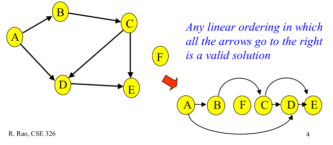
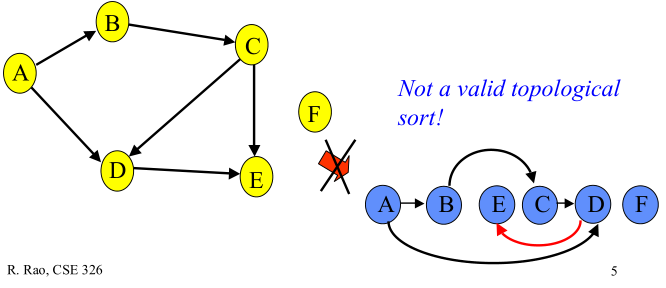

# [图论] 有向无环图的拓扑排序
- [来源](https://www.cnblogs.com/en-heng/p/5085690.html)

## 生词(New Words)
- **topological [tɔpə'lɔdʒikəl] --adj.拓扑的, 拓扑学的**
    + topological sorting. 拓扑排序
- **acyclic [eɪ'saɪklɪk] --adj.非循环的; 非周期的**
    + Directed Acyclic Graph. 有向无环图 
- **degree [dɪ'griː] --n.程度, 等级; 度; 学位; 阶层**


## 内容 (Content)

### 1. 引言
- 有向无环图 (Directed Acyclic Graph, DAG) 是有向图的一种, 字面意思的理解就是图中
  没有环. 常常被用来表示事件之间的驱动依赖关系, 管理任务之间的调度. 拓扑排序是对 DAG 的
  顶点进行排序, 使得对每一条有向边(u, v), 均有 u (在排序记录中) 比 v 先出现. 亦可
  理解为对某些 v 而言, 只有当 v 的所有源点均出现了, v 才能出现.
- 下图给出了有向无环图 的拓扑顺序:  
    + 
    + Any linear ordering in which all the arrows go to the right is a valid
      solution. 所有箭头都在右侧的任何线性顺序都是有效的解决方案.
- 下面给出的顶点排序不是拓扑排序, 因为顶点 D 的邻点 E 比其先出现.
    + 
    + Not a valid topological sort! 不是一个有效的拓扑排序! 

### 2. 算法原理及实现
- 拓扑排序的实现算法有 2 种:
    + (1) 入度表
    + (2) DFS (depth-first search 深度优先搜索)  
  其时间复杂度均为 $O(V + E)$  
#### (1) 入度表
- 对于 DAG 的拓扑排序, 显而易见的办法:
    + (1) 找出图中 0 入度的顶点;
    + (2) 一次在图中删除这些顶点, 删除后再找出 0 入度的顶点;
    + (3) 然后再删除... 再找出...
    + (4) 直到删除所有顶点, 即完成拓扑排序.
- 为了保存 0 入度的顶点, 我们采用数据结构 `栈` (也可用队列); 算法的可视化可参考
  [这里](https://www.cs.usfca.edu/~galles/visualization/TopoSortIndegree.html)
- 图用邻接表 (adjacency list) 表示, 用数组 `inDegreeArray[]` 记录结点的入度变化情况.
  C 实现:
  ```c
    // - 略
  ```
- 时间复杂度: 得到 inDegreeArray[] 数组的复杂度为 O(V + E); 顶点进栈出栈, 其复杂度为
  O(V); 删除顶点后将邻接点的入度减 1, 其复杂度为 O(E); 整个算法的复杂度为 O(V + E).  

#### (2) DFS (depth-first search 深度优先搜索)
- 在 DFS 中, 一次打印所遍历的顶点; 而在拓扑排序时, 顶点必须必其邻接点先出现. 在下图中, 
  顶点 5 比顶点 0 先出现, 顶点 4 比顶点 1 先出现.  
  
- 在 DFS 实现拓扑排序时, 用 **栈** 来保存拓扑排序的顶点序列; 并且保证在某顶点入栈前, 
  其所有邻接点已入栈. DFS 版拓扑排序的可视化参看
  [这里](https://www.cs.usfca.edu/~galles/visualization/TopoSortDFS.html)
 - 时间复杂度：应与DFS相同，为 $𝑂(𝑉 + 𝐸)$。    