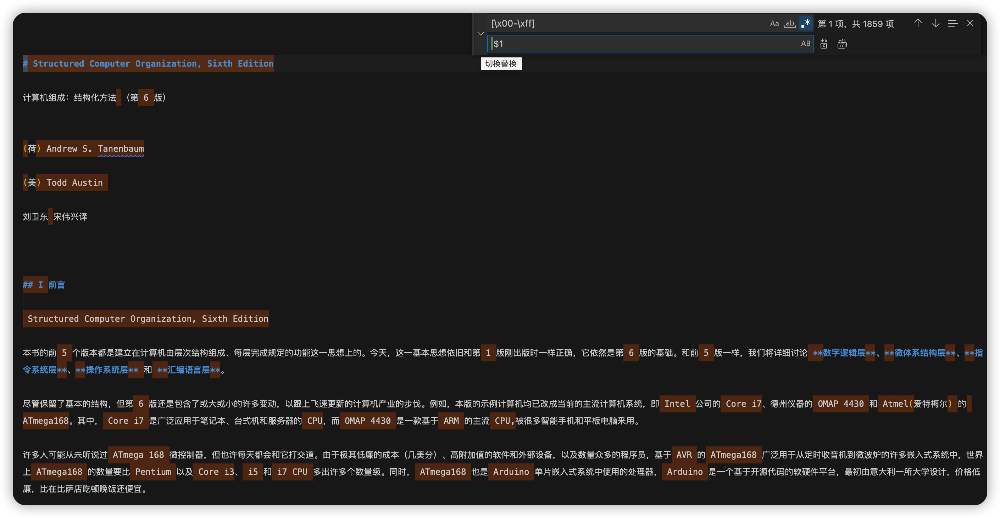
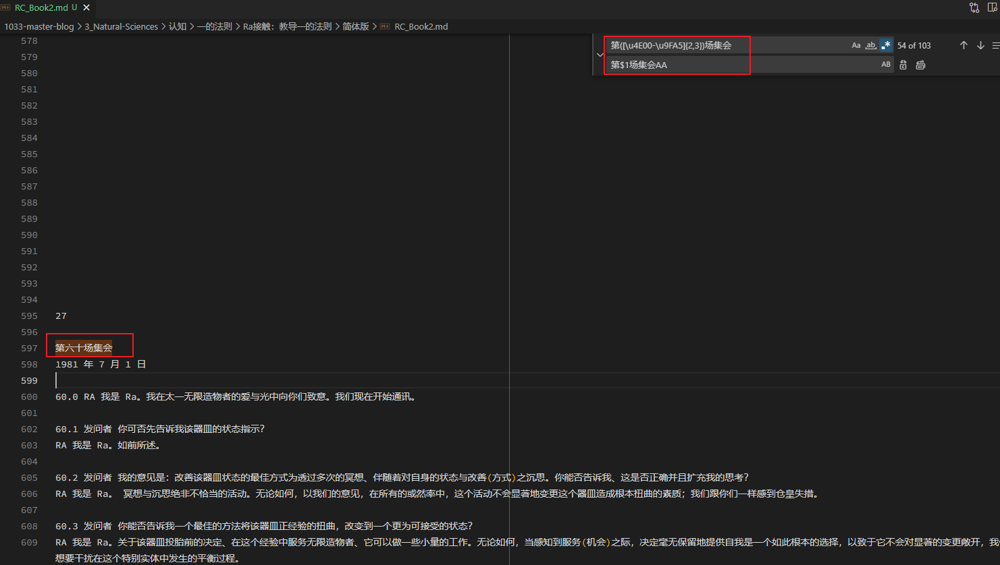
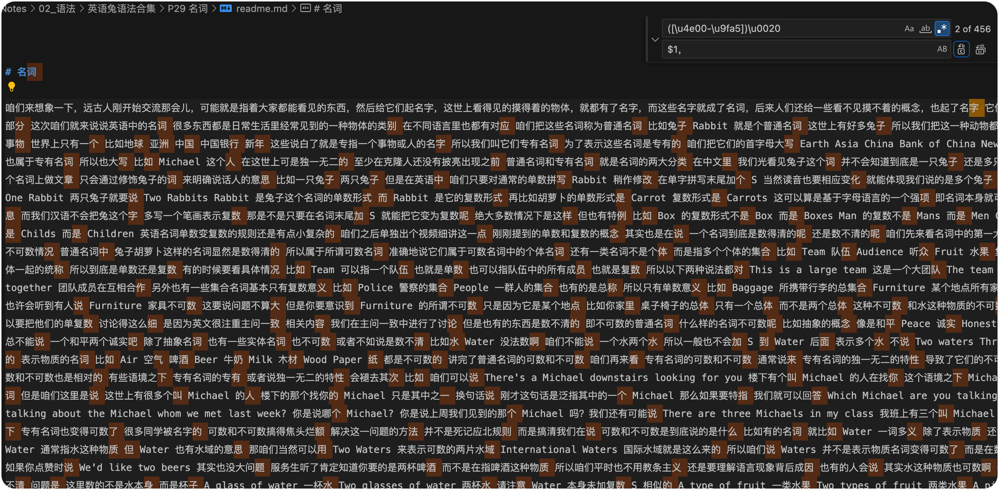

# 正则表达式 (Regular Exp)

Hint: 之前自己整理的笔记不完整， 2022.07.17 根据 code sheep 的在线文档 https://r2coding.com/#/README?id=%e6%ad%a3%e5%88%99%e8%a1%a8%e8%be%be%e5%bc%8f 整合更新。

## ▲ 基础正则表达式速查表 (特殊字符)

==需要把此块笔记当前仓库的 `正则表达式-特殊字符.md` 文档整合，还未完成==

### 字符

| **表达式** | **描述**                                                     | 示例                                                         |
| ---------- | ------------------------------------------------------------ | :----------------------------------------------------------- |
| `[abc]`    | 字符集。匹配集合中所含的任一字符。                           |                                                              |
| `[^abc]`   | 否定字符集。匹配任何不在集合中的字符。                       |                                                              |
| `[a-z]`    | 字符范围。匹配指定范围内的任意字符。                         |                                                              |
| `.`        | 匹配除换行符以外的任何单个字符。                             |                                                              |
| `\`        | (1) 转义字符。作为转意，即通常在 `\`后面的字符不按原来的意义解释。 (2) 也可以将其后的 `特殊字符`转译为字面量。 | (1) `/b/` -- 匹配字符 "b", 当 b 前面加了反斜杆后 `/\b/` 转意为匹配一个单词的边界. (2) 模式 `/a*/` 代表会匹配 0 个或者多个 a. 相反, 模式 `/a\*/` 将 `*`的特殊性移除从而可以匹配像 `a*` 这样的字符串.  |
| `\w`       | 匹配任何字母数字，包括下划线（等价于`[A-Za-z0-9_]`）。       |                                                              |
| `\W`       | 匹配任何非字母数字（等价于`[^A-Za-z0-9_]`）。                |                                                              |
| `\d`       | 数字。匹配任何数字。                                         |                                                              |
| `\D`       | 非数字。匹配任何非数字字符。                                 |                                                              |
| `\s`       | 空白。匹配任何空白字符，包括空格、制表符等。                 |                                                              |
| `\S`       | 非空白。匹配任何非空白字符。                                 |                                                              |

### 分组和引用

| **表达式**       | **描述**                                                     |
| ---------------- | ------------------------------------------------------------ |
| `(expression)`   | 分组。匹配括号里的整个表达式。                               |
| `(?:expression)` | 非捕获分组。匹配括号里的整个字符串但不获取匹配结果，拿不到分组引用。 |
| `\num`           | 对前面所匹配分组的引用。比如`(\d)\1`可以匹配两个相同的数字，`(Code)(Sheep)\1\2`则可以匹配`CodeSheepCodeSheep`。 |

### 锚点/边界

| **表达式** | **描述**                                                     | 示例                                                         |
| ---------- | ------------------------------------------------------------ | ------------------------------------------------------------ |
| `^`        | 匹配字符串或行开头。 匹配字符串的开始位置。 如果设置了多行修饰符(`m`)，也匹配 `\n` 或 `\r` 之后的位置. | e.g.: `/^a/` -- 匹配 "an A"，而不匹配 "An a". e.g.: `(^|&)` -- `^`匹配以字符串开头, `&` 就是 `&` 字符, `(^|&)` 匹配字符串开头或者`&`字符, 如果其后还有正则, 那么必须出现在字符串开始或`&`字符之后. |
| `$`        | 匹配字符串或行结尾。 匹配字符串的结束位置。 如果设置了多行修饰符(`m`)，也匹配 `\n` 或 `\r` 之前的位置. | e.g.: `/a$/` 匹配"An a"，而不匹配"an A".                     |
| `\b`       | 匹配(一个)单词边界。                                         | 比如：`Sheep\b`可以匹配`CodeSheep`末尾的`Sheep`，不能匹配`CodeSheepCode`中的`Sheep` |
| `\B`       | 匹配一个单词的非边界位置                                     | 比如：`Code\B`可以匹配`HelloCodeSheep`中的`Code`，不能匹配`HelloCode`中的`Code`。 |

### 数量表示

| **表达式** | **描述**                                   |
| ---------- | ------------------------------------------ |
| `?`        | 匹配前面的表达式0个或1个。即表示可选项。   |
| `+`        | 匹配前面的表达式至少1个。                  |
| `*`        | 匹配前面的表达式0个或多个。                |
| `|`        | 或运算符。并集，可以匹配符号前后的表达式。 |
| `{m}`      | 匹配前面的表达式m个。                      |
| `{m,}`     | 匹配前面的表达式最少m个。                  |
| `{m,n}`    | 匹配前面的表达式最少m个，最多n个。         |

### 预查断言

| **表达式** | **描述**                                                     |
| ---------- | ------------------------------------------------------------ |
| `(?=)`     | 正向预查。比如`Code(?=Sheep)`能匹配`CodeSheep`中的`Code`，但不能匹配`CodePig`中的`Code`。 |
| `(?!)`     | 正向否定预查。比如`Code(?!Sheep)`不能匹配`CodeSheep`中的`Code`，但能匹配`CodePig`中的`Code`。 |
| `(?<=)`    | 反向预查。比如`(?<=Code)Sheep`能匹配`CodeSheep`中的`Sheep`，但不能匹配`ReadSheep`中的`Sheep`。 |
| `(?<!)`    | 反向否定预查。比如`(?<!Code)Sheep`不能匹配`CodeSheep`中的`Sheep`，但能匹配`ReadSheep`中的`Sheep`。 |

### 特殊标志

| **表达式** | **描述**                                |
| ---------- | --------------------------------------- |
| `/.../i`   | 忽略大小写。                            |
| `/.../g`   | 全局匹配。                              |
| `/.../m`   | 多行（Multiline）修饰符。用于多行匹配。 |

## ▲ 正则表达式可视化工具

> https://jex.im/regulex/

> https://regex101.com/

## ▲ VSCode 中使用正则表达式给 markdown 文档中内添加空格

### (1) 给中文和英文中间添加空格

### (2) 在数字前添加空格

### (3) 给数字和英文字母前添加空格

正则表达式的讲解见：`Github-clone/DataStructure-Algorithm-Learning/正则表达式/正则表达式-特殊字符.md`

### (4) 给一些特定格式的文字添加统一后缀

### (5) 把中文后面的空格替换为逗号

## ▲ 常用正则表达式示例

### 数字校验

| **描述**       | **正则表达式**                                    | **备注**                    |
| -------------- | ------------------------------------------------- | --------------------------- |
| 数字           | `^[0-9]*$`                                        |                             |
| n位数字        | `^\d{n}$`                                         |                             |
| 至少n位数字    | `^\d{n,}$`                                        |                             |
| m~n位数字      | `^\d{m,n}$`                                       |                             |
| 整数           | `^(-?[1-9]\d*)$`                                  | 非0开头，包括正整数和负整数 |
| 正整数         | `^[1-9]\d*$`                                      |                             |
| 负整数         | `^-[1-9]\d*$`                                     |                             |
| 非负整数       | `^(([1-9]\d*)|0)$`                                |                             |
| 非正整数       | `^((-[1-9]\d*)|0)$`                               |                             |
| 浮点数         | `^-?(?:[1-9]\d*\.\d*|0\.\d*[1-9]\d*|0\.0+|0)$`    | 包括正浮点数和负浮点数      |
| 正浮点数       | `^(?:[1-9]\d*\.\d*|0\.\d*[1-9]\d*)$`              |                             |
| 负浮点数       | `^-(?:[1-9]\d*\.\d*|0\.\d*[1-9]\d*)$`             |                             |
| 非正浮点数     | `^(?:-(?:[1-9]\d*\.\d+|0\.\d*[1-9]\d*)|0\.0+|0)$` | 包含0                       |
| 非负浮点数     | `^(?:[1-9]\d*\.\d+|0\.\d+|0\.0+|0)$`              | 包含0                       |
| 仅一位小数     | `^-?(?:0|[1-9][0-9]*)\.[0-9]{1}$`                 |                             |
| 最少一位小数   | `^-?(?:0|[1-9][0-9]*)\.[0-9]{1,}$`                |                             |
| 最多两位小数   | `^-?(?:0|[1-9][0-9]*)\.[0-9]{1,2}$`               |                             |
| 连续重复的数字 | `^(\d)\1+$`                                       | 例如：`111`，`222`          |

------

### 字符校验

| **描述**                             | **正则表达式**                  | **备注**         |
| ------------------------------------ | ------------------------------- | ---------------- |
| 中文                                 | `^[\u4E00-\u9FA5]+$`            |                  |
| 全角字符                             | `^[\uFF00-\uFFFF]+$`            |                  |
| 半角字符                             | `^[\u0000-\u00FF]+$`            |                  |
| 英文字符串（大写）                   | `^[A-Z]+$`                      |                  |
| 英文字符串（小写）                   | `^[a-z]+$`                      |                  |
| 英文字符串（不区分大小写）           | `^[A-Za-z]+$`                   |                  |
| 中文和数字                           | `^(?:[\u4E00-\u9FA5]{0,}|\d)+$` |                  |
| 英文和数字                           | `^[A-Za-z0-9]+$`                |                  |
| 数字、英文字母或者下划线组成的字符串 | `^\w+$`                         |                  |
| 中文、英文、数字包括下划线           | `^[\u4E00-\u9FA5\w]+$`          |                  |
| 不含字母的字符串                     | `^[^A-Za-z]*$`                  |                  |
| 连续重复的字符串                     | `^(.)\1+$`                      | 例如：`aa`，`bb` |
| 长度为n的字符串                      | `^.{n}$`                        |                  |
| ASCII                                | `^[ -~]$`                       |                  |

------

### 日期和时间校验

| **描述**  | **正则表达式**                                               | **备注**                    |
| --------- | ------------------------------------------------------------ | --------------------------- |
| 日期      | `^\d{1,4}-(?:1[0-2]|0?[1-9])-(?:0?[1-9]|[1-2]\d|30|31)$`     | 弱校验，例如：`2022-06-12`  |
| 日期      | `^(?:(?!0000)[0-9]{4}-(?:(?:0[1-9]|1[0-2])-(?:0[1-9]|1[0-9]|2[0-8])|(?:0[13-9]|1[0-2])-(?:29|30)|(?:0[13578]|1[02])-31)|(?:[0-9]{2}(?:0[48]|[2468][048]|[13579][26])|(?:0[48]|[2468][048]|[13579][26])00)-02-29)$` | 严格校验，考虑平闰年        |
| 时间      | `^(?:1[0-2]|0?[1-9]):[0-5]\d:[0-5]\d$`                       | 12小时制，例如：`11:21:31`  |
| 时间      | `^(?:[01]\d|2[0-3]):[0-5]\d:[0-5]\d$`                        | 24小时制，例如：`23:21:31`  |
| 日期+时间 | `^(\d{1,4}-(?:1[0-2]|0?[1-9])-(?:0?[1-9]|[1-2]\d|30|31)) ((?:[01]\d|2[0-3]):[0-5]\d:[0-5]\d)$` | 例如：`2000-11-11 23:20:21` |

------

### 日常生活相关

| **描述**         | **正则表达式**                                               | **备注**                                                   |
| ---------------- | ------------------------------------------------------------ | ---------------------------------------------------------- |
| 中文名           | `^[\u4E00-\u9FA5·]{2,16}$`                                   |                                                            |
| 英文名           | `^[a-zA-Z][a-zA-Z\s]{0,20}[a-zA-Z]$`                         |                                                            |
| 车牌号           | `^[京津沪渝冀豫云辽黑湘皖鲁新苏浙赣鄂桂甘晋蒙陕吉闽贵粤青藏川宁琼使领][A-HJ-NP-Z][A-HJ-NP-Z0-9]{4}[A-HJ-NP-Z0-9挂学警港澳]$` | 不含新能源                                                 |
| 车牌号           | `^[京津沪渝冀豫云辽黑湘皖鲁新苏浙赣鄂桂甘晋蒙陕吉闽贵粤青藏川宁琼使领][A-HJ-NP-Z](?:(?:[A-HJ-NP-Z0-9]{4}[A-HJ-NP-Z0-9挂学警港澳])|(?:(?:\d{5}[A-HJK])|(?:[A-HJK][A-HJ-NP-Z0-9][0-9]{4})))$` | 包含新能源                                                 |
| 火车车次         | `^[GCDZTSPKXLY1-9]\d{1,4}$`                                  | 例如：`G1234`                                              |
| 手机号           | `^(?:(?:\+|00)86)?1[3-9]\d{9}$`                              | 弱匹配                                                     |
| 手机号           | `^(?:(?:\+|00)86)?1(?:(?:3[\d])|(?:4[5-79])|(?:5[0-35-9])|(?:6[5-7])|(?:7[0-8])|(?:8[\d])|(?:9[189]))\d{8}$` | 严格匹配                                                   |
| 固话号码         | `^(?:(?:\d{3}-)?\d{8}|^(?:\d{4}-)?\d{7,8})(?:-\d+)?$`        |                                                            |
| 手机IMEI码       | `^\d{15,17}$`                                                | 一般是15位                                                 |
| 邮编             | `^(?:0[1-7]|1[0-356]|2[0-7]|3[0-6]|4[0-7]|5[1-7]|6[1-7]|7[0-5]|8[013-6])\d{4}$` | 例如：`211100`                                             |
| 统一社会信用代码 | `^[0-9A-HJ-NPQRTUWXY]{2}\d{6}[0-9A-HJ-NPQRTUWXY]{10}$`       |                                                            |
| 身份证号码(1代)  | `^[1-9]\d{7}(?:0\d|10|11|12)(?:0[1-9]|[1-2][\d]|30|31)\d{3}$` | 15位数字                                                   |
| 身份证号码(2代)  | `^[1-9]\d{5}(?:18|19|20)\d{2}(?:0[1-9]|10|11|12)(?:0[1-9]|[1-2]\d|30|31)\d{3}[0-9Xx]$` | 18位数字                                                   |
| QQ号             | `^[1-9][0-9]{4,}$`                                           | 一般是5到10位                                              |
| 微信号           | `^[a-zA-Z][-_a-zA-Z0-9]{5,19}$`                              | 一般6~20位，字母开头，可包含字母、数字、-、_，不含特殊字符 |
| 股票代码         | `^(s[hz]|S[HZ])(000[\d]{3}|002[\d]{3}|300[\d]{3}|600[\d]{3}|60[\d]{4})$` | A股，例如：`600519`                                        |
| 银行卡卡号       | `^[1-9]{1}(?:\d{15}|\d{18})$`                                | 一般为19位                                                 |

------

### 互联网相关

| **描述**             | **正则表达式**                                               | **备注**                                                     |
| -------------------- | ------------------------------------------------------------ | ------------------------------------------------------------ |
| 域名                 | `^[a-zA-Z0-9][-a-zA-Z0-9]{0,62}(?:\.[a-zA-Z0-9][-a-zA-Z0-9]{0,62})+$` | 例如：`r2coding.com`                                         |
| 网址                 | `^(?:https?:\/\/)?[a-zA-Z0-9][-a-zA-Z0-9]{0,62}(?:\.[a-zA-Z0-9][-a-zA-Z0-9]{0,62})+$` | 例如：`https://www.r2coding.com/`                            |
| 带端口号的网址(或IP) | `^(?:https?:\/\/)?[\w-]+(?:\.[\w-]+)+:\d{1,5}\/?$`           | 例如：`http://127.0.0.1:8888/`                               |
| URL                  | `^https?:\/\/(?:www\.)?[-a-zA-Z0-9@:%._\+~#=]{1,256}\.[a-zA-Z0-9()]{1,6}\b(?:[-a-zA-Z0-9()!@:%_\+.~#?&\/\/=]*)$` | 例如：`https://www.r2coding.com/#/README?id=1`               |
| 邮箱email            | `^[A-Za-z0-9\u4e00-\u9fa5]+@[a-zA-Z0-9][-a-zA-Z0-9]{0,62}(?:\.[a-zA-Z0-9][-a-zA-Z0-9]{0,62})+$` | 支持中文，例如：`codesheep@cs.com`                           |
| 用户名               | `^[a-zA-Z0-9_-]{4,20}$`                                      | 4到20位                                                      |
| 弱密码               | `^[\w]{6,16}$`                                               | 6~16位，包含大小写字母和数字的组合                           |
| 强密码               | `^.*(?=.{6,})(?=.*\d)(?=.*[A-Z])(?=.*[a-z])(?=.*[!@\.#$%^&*? ]).*$` | 至少6位，包括至少1个大写字母，1个小写字母，1个数字，1个特殊字符 |
| 端口号               | `^(?:[0-9]|[1-9][0-9]{1,3}|[1-5][0-9]{4}|6[0-4][0-9]{3}|65[0-4][0-9]{2}|655[0-2][0-9]|6553[0-5])$` | 例如：`65535`                                                |
| IPv4地址             | `^(?:(?:\d|[1-9]\d|1\d\d|2[0-4]\d|25[0-5])\.){3}(?:\d|[1-9]\d|1\d\d|2[0-4]\d|25[0-5])$` | 例如：`192.168.31.1`                                         |
| IPv4地址+端口        | `^(?:(?:\d|[1-9]\d|1\d\d|2[0-4]\d|25[0-5])\.){3}(?:\d|[1-9]\d|1\d\d|2[0-4]\d|25[0-5])(?::(?:[0-9]|[1-9][0-9]{1,3}|[1-5][0-9]{4}|6[0-4][0-9]{3}|65[0-4][0-9]{2}|655[0-2][0-9]|6553[0-5]))?$` | 例如：`192.168.31.1:8080`                                    |
| IPv6地址             | `^(([0-9a-fA-F]{1,4}:){7,7}[0-9a-fA-F]{1,4}|([0-9a-fA-F]{1,4}:){1,7}:|([0-9a-fA-F]{1,4}:){1,6}:[0-9a-fA-F]{1,4}|([0-9a-fA-F]{1,4}:){1,5}(:[0-9a-fA-F]{1,4}){1,2}|([0-9a-fA-F]{1,4}:){1,4}(:[0-9a-fA-F]{1,4}){1,3}|([0-9a-fA-F]{1,4}:){1,3}(:[0-9a-fA-F]{1,4}){1,4}|([0-9a-fA-F]{1,4}:){1,2}(:[0-9a-fA-F]{1,4}){1,5}|[0-9a-fA-F]{1,4}:((:[0-9a-fA-F]{1,4}){1,6})|:((:[0-9a-fA-F]{1,4}){1,7}|:)|fe80:(:[0-9a-fA-F]{0,4}){0,4}%[0-9a-zA-Z]{1,}|::(ffff(:0{1,4}){0,1}:){0,1}((25[0-5]|(2[0-4]|1{0,1}[0-9]){0,1}[0-9])\.){3,3}(25[0-5]|(2[0-4]|1{0,1}[0-9]){0,1}[0-9])|([0-9a-fA-F]{1,4}:){1,4}:((25[0-5]|(2[0-4]|1{0,1}[0-9]){0,1}[0-9])\.){3,3}(25[0-5]|(2[0-4]|1{0,1}[0-9]){0,1}[0-9]))$` | 例如：`CDCD:910A:2222:5498:8475:1111:3900:2020`              |
| IPv6地址+端口        | `^\[(([0-9a-fA-F]{1,4}:){7,7}[0-9a-fA-F]{1,4}|([0-9a-fA-F]{1,4}:){1,7}:|([0-9a-fA-F]{1,4}:){1,6}:[0-9a-fA-F]{1,4}|([0-9a-fA-F]{1,4}:){1,5}(:[0-9a-fA-F]{1,4}){1,2}|([0-9a-fA-F]{1,4}:){1,4}(:[0-9a-fA-F]{1,4}){1,3}|([0-9a-fA-F]{1,4}:){1,3}(:[0-9a-fA-F]{1,4}){1,4}|([0-9a-fA-F]{1,4}:){1,2}(:[0-9a-fA-F]{1,4}){1,5}|[0-9a-fA-F]{1,4}:((:[0-9a-fA-F]{1,4}){1,6})|:((:[0-9a-fA-F]{1,4}){1,7}|:)|fe80:(:[0-9a-fA-F]{0,4}){0,4}%[0-9a-zA-Z]{1,}|::(ffff(:0{1,4}){0,1}:){0,1}((25[0-5]|(2[0-4]|1{0,1}[0-9]){0,1}[0-9])\.){3,3}(25[0-5]|(2[0-4]|1{0,1}[0-9]){0,1}[0-9])|([0-9a-fA-F]{1,4}:){1,4}:((25[0-5]|(2[0-4]|1{0,1}[0-9]){0,1}[0-9])\.){3,3}(25[0-5]|(2[0-4]|1{0,1}[0-9]){0,1}[0-9]))\](?::(?:[0-9]|[1-9][0-9]{1,3}|[1-5][0-9]{4}|6[0-4][0-9]{3}|65[0-4][0-9]{2}|655[0-2][0-9]|6553[0-5]))?$` | 例如：`[CDCD:910A:2222:5498:8475:1111:3900:2020]:9800`       |
| 子网掩码             | `^(?:254|252|248|240|224|192|128)\.0\.0\.0|255\.(?:254|252|248|240|224|192|128|0)\.0\.0|255\.255\.(?:254|252|248|240|224|192|128|0)\.0|255\.255\.255\.(?:255|254|252|248|240|224|192|128|0)$` | 例如：`255.255.255.0`                                        |
| MAC地址              | `^(?:(?:[a-f0-9A-F]{2}:){5}|(?:[a-f0-9A-F]{2}-){5})[a-f0-9A-F]{2}$` |                                                              |
| Version版本号        | `^\d+(?:\.\d+){2}$`                                          | 例如：`12.1.1`                                               |
| 图片后缀             | `\.(gif|png|jpg|jpeg|webp|svg|psd|bmp|tif)+`                 | 可按需增删扩展名集合                                         |
| 视频后缀             | `\.(swf|avi|flv|mpg|rm|mov|wav|asf|3gp|mkv|rmvb|mp4)+`       | 可按需增删扩展名集合                                         |
| 图片链接             | `(?:https?:\/\/)?[a-zA-Z0-9][-a-zA-Z0-9]{0,62}(?:\.[a-zA-Z0-9][-a-zA-Z0-9]{0,62})+.+\.(gif|png|jpg|jpeg|webp|svg|psd|bmp|tif)` | 可按需增删扩展名集合                                         |
| 视频链接             | `(?:https?:\/\/)?[a-zA-Z0-9][-a-zA-Z0-9]{0,62}(?:\.[a-zA-Z0-9][-a-zA-Z0-9]{0,62})+.+\.(swf|avi|flv|mpg|rm|mov|wav|asf|3gp|mkv|rmvb|mp4)` | 可按需增删扩展名集合                                         |
| 迅雷链接             | `thunderx?:\/\/[a-zA-Z\d]+=`                                 |                                                              |
| ed2k链接             | `ed2k:\/\/\|file\|.+\|\/`                                    |                                                              |
| 磁力链接             | `magnet:\?xt=urn:btih:[0-9a-fA-F]{40,}.*`                    |                                                              |

------

### 其他

| **描述**          | **正则表达式**                                               | **备注**                                          |
| ----------------- | ------------------------------------------------------------ | ------------------------------------------------- |
| MD5格式           | `^(?:[a-f\d]{32}|[A-F\d]{32})$`                              | 32位MD5，例如：`7552E7071B118CBFFEC8C930455B4297` |
| BASE64格式        | `^\s*data:(?:[a-z]+\/[a-z0-9-+.]+(?:;[a-z-]+=[a-z0-9-]+)?)?(?:;base64)?,([a-z0-9!$&',()*+;=\-._~:@/?%\s]*?)\s*$` | 例如：`data:image/jpeg;base64,xxxx==`             |
| UUID              | `^[a-f\d]{4}(?:[a-f\d]{4}-){4}[a-f\d]{12}$`                  | 例如：`94f9d45a-71b0-4b3c-b69d-20c4bc9c8fdd`      |
| 16进制            | `^[A-Fa-f0-9]+$`                                             | 例如：`FFFFFF`                                    |
| 16进制颜色        | `^#?([0-9a-fA-F]{3}|[0-9a-fA-F]{6})$`                        | 例如：`#FFFFFF`                                   |
| SQL语句           | `^(?:select|drop|delete|create|update|insert).*$`            |                                                   |
| Java包名          | `^(?:[a-zA-Z_]\w*)+(?:[.][a-zA-Z_]\w*)+$`                    | 例如：`com.r2coding.controller`                   |
| 文件扩展名        | `\.(?:doc|pdf|txt)`                                          | 可按需增删扩展名集合                              |
| Windows文件路径   | `^[a-zA-Z]:(?:\\[\w\u4E00-\u9FA5\s]+)+[.\w\u4E00-\u9FA5\s]+$` | 例如：`C:\Users\Administrator\Desktop\a.txt`      |
| Windows文件夹路径 | `^[a-zA-Z]:(?:\\[\w\u4E00-\u9FA5\s]+)+$`                     | 例如：`C:\Users\Administrator\Desktop`            |
| Linux文件路径     | `^\/(?:[^/]+\/)*[^/]+$`                                      | 例如：`/root/library/a.txt`                       |
| Linux文件夹路径   | `^\/(?:[^/]+\/)*$`                                           | 例如：`/root/library/`                            |
