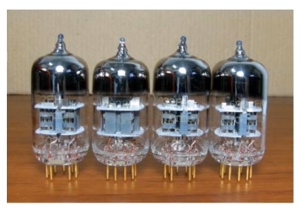
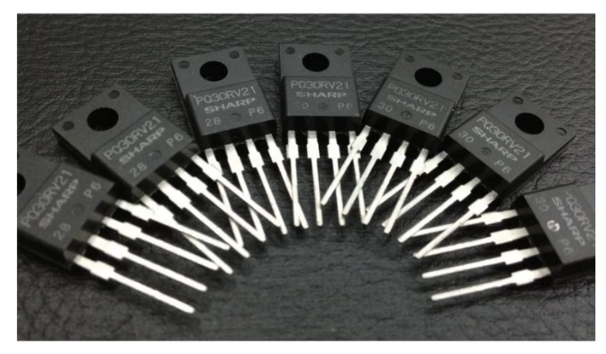
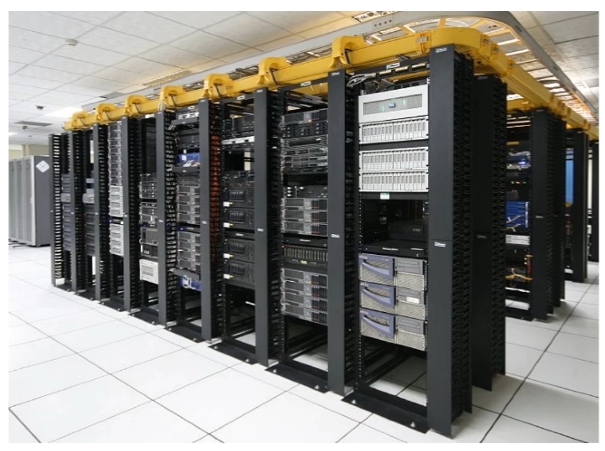
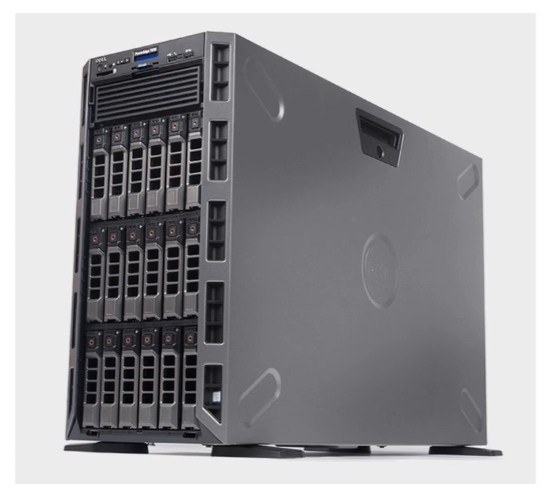
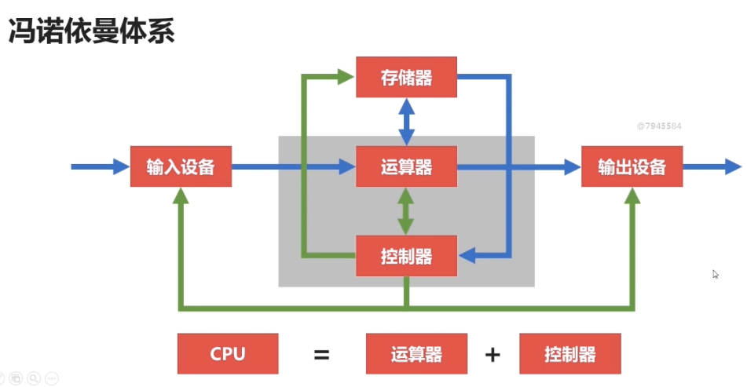
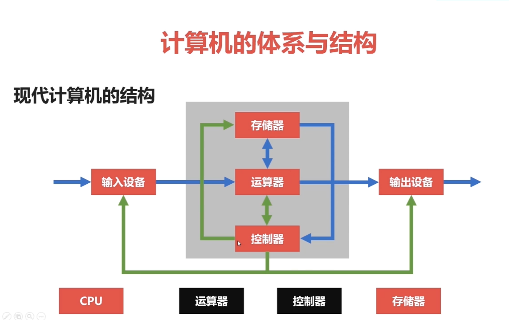
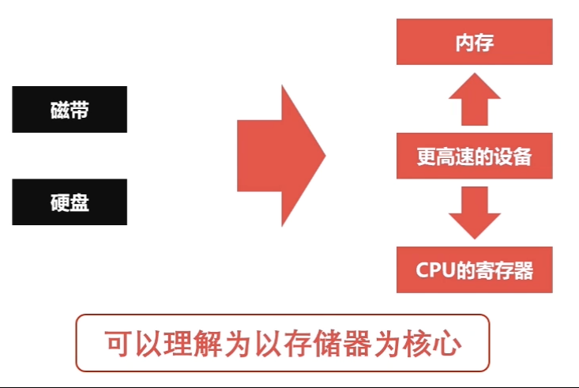

# 第 2 章 -- 计算机组成原理之概述篇

## 生词 (New Words)
- **architecture ['ɑ:kitektʃə] --n.建筑，结构**
    + advanced computer architecture 高级计算机体系结构
    + [ancient ['eɪnʃ(ə)nt/ --adj.古代的，古老的 --n.古人] architecture 古代建筑

## 2-1 计算机发展简史
#### 1. 计算机发展的 4 个阶段
+ 第 1 个阶段: 电子管计算机 (1946 - 1957)
    - 
    - 第二次世界大战是电子管计算机产生的催化剂, 英国为了解密德国海军的密文
    - 最具代表的是: 埃尼阿克(ENIAC)
+ 第 2 个阶段: 晶体管计算机 (1957 - 1964)
    - 产生: 1948 年 贝尔实验室的三个科学家发明了晶体管.(1956 年的诺贝尔物理奖授予次
        三个科学家)
    - 
    - 全世界第一台晶体管计算机: TX-0, 诞生于 麻省理工大学(MIT)林肯实验室. 在当时还有
        一台性能最高的晶体管计算机: PDP-1, 具备 4K 内存, 每秒可执行 200000 条指令,且 
        配备了当时第一台 512 x 512 的显示器.
+ 第 3 个阶段: 集成电路计算机 (1964 - 1980)
    - 出现的原因: 当时德州仪器的工程师发明了集成电路 (IC), 
+ 第 4 个阶段: 超大规模集成电路计算机 (1980 - now)
    - 特点: 
        + ◆ 一个芯片集成了，上百万的晶体管
        + ◆ 速度更快，体积更小，价格更低，更能被大众接受
        + ◆ 用途丰富:文本处理、表格处理、高交互的游戏与应用
+ 第 5 个阶段: 未来的计算机 ???
    - 畅想可能有: 
        + (1) 生物计算机
            * ◆体积小，效率高
            * ◆不易损坏，生物级别的自动修复
            * ◆不受信号干扰，无热损耗
        + (2) 量子计算机: 遵循量子力学的物理计算机
#### 2. 微型计算机的发展历史.

## 2-3 计算机的分类
#### 1. 超级计算机
- (1) 功能最强、运算速度最快、存储容量最大的计算机
    + 特点: 标记他们运算速度的单位是 `TFlop/s`. `1TFlop/s = 每秒一万亿次浮点计算.`
        - 对比: Intel(R) Core(TM) i7-6700K CPU @4.00GHz: 44.87 GFlop/s. 
          `44.87 GFlop/s = 0.04487 TFlop/s`
- (2) 多用于国家高科技领域和尖端技术研究
#### 2. 大型计算机:
- (1) 又称 大型机, 大型主机, 主机 等
- (2) 具有高性能, 可处理大量数据与复杂的运算
    + 最具有代表的是 IBM
    + 阿里 2008 年提出去 'IOE' 行动. (I(IBM), O(Oracle), E(EMC)), 接着 2009 年
      成立了 阿里云
#### 3. 小型(迷你)计算机 (服务器)
- (1) 也称为小型机，普通服务器
- (2) 不需要特殊的空调场所
- (3) 具备不错的算力，可以完成较复杂的运算
- 
#### 4. 工作站
- (1) 高端的通用微型计算机，提供比个人计算机更强大的性能
- (2) 类似于普通台式电脑，体积较大,但性能强劲
- 
#### 5. 微型计算机: 又称为个人计算机, 是最普通的一类计算机.

## 2-4 计算机的体系与结构
#### 1. 冯诺依曼体系和结构
- 冯·诺伊曼结构（英语：Von Neumann architecture）:
    + 也称 冯·诺伊曼模型(Von Neumann model)或 普林斯顿结构(Princeton architecture)
      ，是一种将`程序指令存储器` 和 `数据存储器`合并在一起的电脑设计概念结构。本词描述的是
      一种实现通用图灵机的计算设备，以及一种相对于并行计算的序列式结构参考模型 
      (referential model）。
    + 本结构隐约指导了将`存储设备`与`中央处理器`分开的概念，因此依本结构设计出的计算机又称
      存储程序计算机。
- (1) 理论: 
    + 存储程序计算机在体系结构上主要特点有：
        * 以运算单元为中心
        * 采用存储程序原理
        * 存储器是按地址访问、线性编址的空间
        * 控制流由指令流产生
        * 指令由操作码和地址码组成
        * 数据以二进制编码
- (2) 历史:
    + 最早的计算机器仅内含固定用途的程序. 例如一个计算器仅有固定的数学计算程序，它不能拿来
      当作文字处理软件，更不能拿来玩游戏。若想要改变此机器的程序，你必须更改线路、更改结构
      甚至重新设计此机器.
    + {1}指令集架构，又称指令集或指令集体系，是计算机体系结构中与程序设计有关的部分，包含了
      `基本数据类型`，`指令集`，`寄存器`，`寻址模式`，`存储体系`，`中断，异常处理`以及
      `外部I/O`。指令集架构包含一系列的 opcode 即 操作码（机器语言），以及由特定处理器
      执行的基本命令。
    + 

- 冯诺依曼结构图:
    + 
- 冯诺依曼瓶颈:
    + CPU 和存储速率之间的问题无法调和.
#### 2. 现在计算机的体系与结构 (在冯诺依曼体系的基础上解决了 CPU 和 存储速录之间的读取问题)
-  
-  
      